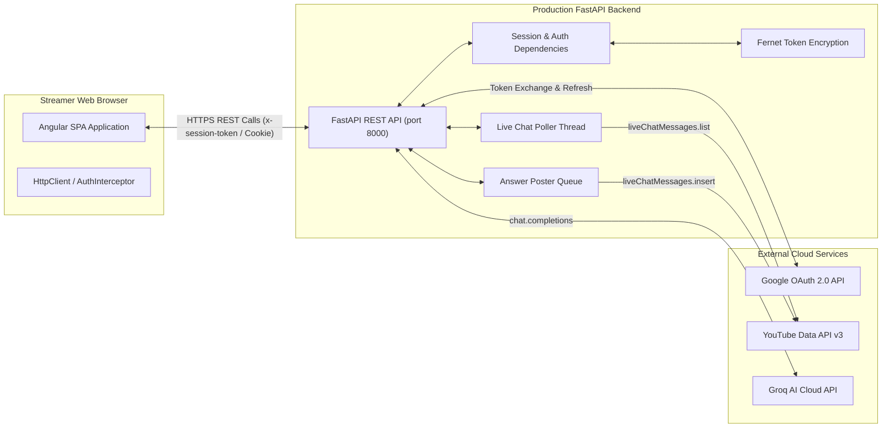

# Angular Frontend Migration and UI Plan

**Last analyzed:** 2026-10-02  
**Repository:** `D:\work\Comment-analyzer`

---

## 1. Migration Goal

### Executive Summary
The goal of this migration plan is to transition the **Stream Assistant AI** user interface from Streamlit (`streamlit_app.py`) to a modern, responsive **Angular Single-Page Application (SPA)**, while retaining the existing Python/FastAPI backend, Google OAuth integration, YouTube live-chat polling engine, Q&A memory bank, and live chat posting capabilities.

### Security Architecture Principles
1. **Zero Client-Side Secrets**: The Angular application runs entirely inside the user's web browser. It must **never** store, access, or transmit `GOOGLE_CLIENT_SECRET`, YouTube API keys, OAuth access/refresh tokens, or Fernet encryption keys.
2. **Server-Side API Gateway**: All interactions with Google OAuth, YouTube Data API v3, Groq LLM API, and local disk storage remain strictly inside the FastAPI backend.
3. **No Direct YouTube Calls**: Angular must **never** invoke YouTube API endpoints directly (e.g. `liveChatMessages.insert` or `videos.list`). All operations are performed by sending secure requests to FastAPI backend endpoints over HTTPS.
4. **Authoritative Backend Validation**: FastAPI validates user session cookies/headers, channel ownership, active stream context, and liveChatId matching before performing any state mutations or YouTube posts.

### Architecture Comparison

| Architecture Dimension | Current Architecture (Streamlit) | Target Architecture (Angular + FastAPI) |
| :--- | :--- | :--- |
| **Frontend UI** | Streamlit Python UI (`streamlit_app.py`) | Angular 18+ Single Page Application (TypeScript) |
| **UI Refresh Mechanism** | Streamlit Fragment Auto-Refresh (`run_every=2`) | Angular Signals / RxJS polling against FastAPI REST endpoints |
| **Backend API** | FastAPI 0.142+ / Uvicorn | FastAPI 0.142+ / Uvicorn (Unchanged core engine) |
| **Authentication Strategy** | Query parameter code exchange & cookies | OpenID Connect / HTTP-only Secure Cookies + `x-session-token` |
| **Data Flow** | Streamlit calls backend functions & REST API | Angular HttpClient calls FastAPI REST endpoints over HTTPS |
| **Deployment Model** | Single Streamlit Cloud container with uvicorn thread | Angular hosted on static CDN (Vercel/Netlify/S3); FastAPI hosted on Render/Railway |

---

## 2. Current UI Inventory

Every feature currently present in `streamlit_app.py` is mapped below to its corresponding backend data requirement and target Angular component.

| Feature Name | Current Streamlit Location | User View / Action | Backend Data / Action Required | Target Angular Component | Current Backend API | Proposed API Endpoint |
| :--- | :--- | :--- | :--- | :--- | :--- | :--- |
| **Google Sign-In** | `login_page()` (L979-1022) | Display hero card; click "Continue with Google Account" | Initialize OAuth state; build Google authorization URL | `LoginComponent` | `GET /api/auth/login/init` | *Implemented* |
| **OAuth Callback Status** | `check_auth_token()` (L905-937) | Displays loading spinner during OAuth callback | Exchange code for tokens, generate session token | `OauthCallbackComponent` | `POST /api/auth/login/callback` | *Implemented* |
| **Account & Channel Header** | `render_sidebar()` (L286-300) | Displays logged-in account label & verified channel badge | Returns active session user profile & connected channels | `TopbarComponent` / `AuthStatusComponent` | `GET /api/me` | *Implemented* |
| **Channel Selection** | `channel_selection_page()` (L1024-1059) | Displays list of verified YouTube channels; click "Connect Channel" | Binds selected channel ID to user session | `ChannelSelectorComponent` | `POST /api/oauth/select_channel` | *Implemented* |
| **Video Stream Connection** | `render_sidebar()` (L381-424) | Input Video ID/URL; click "Connect Video Stream" | Resolves `activeLiveChatId`, channel title, and video details | `StreamConnectionComponent` | *Called directly in UI script* | `POST /api/assistant/connect_stream` *(Proposed)* |
| **Start Assistant** | `render_sidebar()` (L430-445) | Click "▶️ Start Assistant" | Starts polling thread, sets `live_chat_id`, increments generation counter | `StreamControlComponent` | *Called directly in UI script* | `POST /api/assistant/start` *(Proposed)* |
| **Stop Assistant** | `render_sidebar()` (L430-438) | Click "🛑 Stop Assistant" | Stops polling thread, clears session queue, bumps generation | `StreamControlComponent` | *Called directly in UI script* | `POST /api/assistant/stop` *(Proposed)* |
| **Active Stream Status Metric** | `render_header()` (L452-492) | Displays "LIVE 🟢" or "IDLE ⏸️" badge and stream counts | Snapshot of assistant state & active stream question count | `StreamStatusComponent` | `GET /api/me` | `GET /api/assistant/status` *(Proposed)* |
| **Live Chat Feed** | `render_live_feed()` (L497-530) | Renders recent live chat messages with sentiment badges | Snapshot of `recent_messages` array | `LiveFeedComponent` | *In-memory poller state* | `GET /api/assistant/feed` *(Proposed)* |
| **Suggested Answers (Medium Match)** | `render_suggestions()` (L532-581) | Cards with 0.50-0.79 confidence match; "Post Response" / "Dismiss" | Suggestions array; posting queues message to poster | `SuggestionsQueueComponent` | *In-memory poller state* | `GET /api/assistant/suggestions` *(Proposed)* |
| **Super Chat Alerts** | `render_superchats()` (L583-600) | Displays Superchat badges; click "Acknowledge" | Superchats array; acknowledges alert ID | `SuperchatsPanelComponent` | *In-memory poller state* | `GET /api/assistant/superchats` *(Proposed)* |
| **Pending Question Queue** | `render_pending()` (L603-658) | Cards showing questions ($\text{score} < 0.50$), occurrence count, author | Stream-isolated pending questions queue | `QuestionQueueComponent` | *Called directly in UI script* | `GET /api/assistant/pending` *(Proposed)* |
| **Occurrence Selector** | `render_pending()` (L629-636) | Dropdown selecting specific viewer ask occurrence | Returns occurrence array for selected question | `QuestionOccurrenceSelectorComponent` | *In-memory file read* | Included in `GET /api/assistant/pending` *(Proposed)* |
| **AI Draft Generation** | `render_pending()` (L660-673) | Click "✨ Get AI Draft" | Calls Groq API with host Q&A context; returns draft string | `AiDraftButtonComponent` | *Called directly in UI script* | `POST /api/ai/draft` *(Proposed)* |
| **Save & Approve (Memory Only)** | `render_pending()` (L686-694) | Saves Q&A pair to memory bank; removes from pending queue | Adds record to `qa_data.json`; removes key from pending | `SaveApproveButtonComponent` | *Called directly in UI script* | `POST /api/qa/memory` *(Proposed)* |
| **Save & Post Now** | `render_pending()` (L696-734) | Click "🚀 Save & Post Now" | Validates target chat ID, posts message to YouTube Live Chat | `SavePostNowButtonComponent` | `POST /api/channel/{channel_id}/post` | *Implemented* |
| **Auto-Reply Toggle** | `render_sidebar()` (L351-356) | Checkbox enabling automatic posting on score $\ge 0.80$ | Updates `state.auto_reply` toggle boolean | `AutoReplyToggleComponent` | *In-memory poller state* | `POST /api/assistant/settings` *(Proposed)* |
| **Ignored Chat Bots Input** | `render_sidebar()` (L368-377) | Textarea listing bot display names or `UC...` channel IDs | Updates `state.ignored_names` and `ignored_ids` | `IgnoredBotsSettingComponent` | *In-memory poller state* | `POST /api/assistant/settings` *(Proposed)* |
| **Q&A Memory Bank Editor** | `render_memory_editor()` (L838-901) | View, add, search, and delete approved Q&A records | CRUD operations on `qa_data.json` | `QaLibraryComponent` | *Called directly in UI script* | `GET/POST/DELETE /api/qa/memory` *(Proposed)* |
| **Matcher Sandbox Tester** | `render_memory_editor()` (L892-900) | Test question input; displays confidence score & matched answer | Computes Jaccard lexical match score | `MatcherSandboxComponent` | *Called directly in UI script* | `POST /api/qa/test_matcher` *(Proposed)* |
| **Video Comments Analytics** | `render_video_comments_tab()` (L809-833) | Input video ID; fetch public comments & analyze sentiment | Fetches comment threads via API key; runs VADER | `CommentAnalyticsComponent` | *Called directly in UI script* | `POST /api/comments/analyze` *(Proposed)* |
| **Disconnect & Logout** | `render_sidebar()` (L301-314, L334-342) | Click "Disconnect Channel" or "Log out" | Revokes session token; deletes encrypted token file | `SettingsComponent` / `TopbarComponent` | `POST /api/auth/logout`, `POST /api/oauth/disconnect` | *Implemented* |

---

## 3. Proposed Angular UI Design

### Dashboard Layout & User Experience
The Angular frontend will feature a responsive, high-performance dark-theme layout tailored for live stream creators:
* **Desktop-First Design**: Multi-column dashboard optimizing screen real estate for live broadcasts (Stream Status, Work Queue, Answer Composer, Live Chat Feed).
* **Mobile/Tablet Responsive**: Collapsible sidebar navigation, tabbed interface on mobile screens ($<768\text{px}$).
* **Theme Styling**: Dark-mode palette matching modern broadcasting software (OBS Studio / YouTube Studio):
  * Background: `#0B0E14` (Deep space dark)
  * Card Background: `rgba(20, 26, 36, 0.65)` (Glassmorphism with backdrop blur)
  * Primary Accent: `#00F2FE` (Cyan glow)
  * Secondary Accent: `#4FACFE` (Electric blue)
  * Warning/Negative: `#FF3B5C` (Live red) / `#FFB800` (Amber)
  * Success/Positive: `#10B981` (Emerald green)

### Accessibility Standards (WCAG 2.1 AA)
* **Contrast Ratio**: Minimum 4.5:1 ratio for all body text and UI labels against dark backgrounds.
* **Keyboard Navigation**: Full `Tab` key focus support across form inputs, question cards, and action buttons. Visible cyan focus rings (`outline: 2px solid #00F2FE`).
* **ARIA Attributes**: Proper `aria-label`, `aria-live="poller"`, and `role="status"` tags for dynamic feed updates.
* **Disabled Button Explanations**: Disabled state buttons display informative tooltips (e.g. *"Connect a live stream and start assistant to post responses"*).

### Proposed Screen / Page Breakdown

1. **`LoginComponent` (`/login`)**:
   * Hero banner, features feature cards, and "Continue with Google Account" action button.
2. **`OauthCallbackComponent` (`/auth/callback`)**:
   * Handles OAuth code exchange, renders loading status, redirects to Dashboard on completion.
3. **`DashboardComponent` (`/dashboard`)**:
   * Main workspace combining Stream Connection, Active Stream Status, Question Queue, Answer Composer, and Live Chat Feed.
4. **`QaLibraryComponent` (`/qa-library`)**:
   * Full-page management for approved Q&A records, bulk legacy import, search, and Matcher Sandbox.
5. **`AnalyticsComponent` (`/analytics`)**:
   * YouTube video comment sentiment analysis tool (fetching public comment threads and rendering positive/negative breakdown).
6. **`SettingsComponent` (`/settings`)**:
   * Managed YouTube channel connection, bot filter settings, auto-reply threshold controls, and logout/disconnect buttons.

### Angular Component Tree

```text
AppShellComponent
├── TopbarComponent
│   ├── AuthStatusComponent
│   └── ChannelBadgeComponent
├── SidebarNavigationComponent
├── RouterOutlet
│   ├── LoginComponent
│   ├── OauthCallbackComponent
│   ├── DashboardComponent
│   │   ├── StreamConnectionComponent
│   │   ├── StreamStatusComponent
│   │   ├── QuestionQueueComponent
│   │   │   ├── QuestionCardComponent
│   │   │   └── QuestionOccurrenceSelectorComponent
│   │   ├── SuggestionsQueueComponent
│   │   ├── AnswerComposerComponent
│   │   │   ├── AiDraftButtonComponent
│   │   │   ├── SaveApproveButtonComponent
│   │   │   └── SavePostNowButtonComponent
│   │   ├── LiveFeedComponent
│   │   └── SuperchatsPanelComponent
│   ├── QaLibraryComponent
│   │   ├── QaRecordEditorComponent
│   │   └── MatcherSandboxComponent
│   ├── AnalyticsComponent
│   └── SettingsComponent
└── NotificationToastComponent
```

---

## 4. Angular-to-FastAPI Integration Architecture



### Critical Security Boundaries
1. **No Credentials in Frontend Source**: Angular `environment.ts` contains ONLY the public FastAPI backend URL (e.g. `https://api.commentanalyzer.com`). No API keys or OAuth secrets exist in frontend code.
2. **Target Chat Validation**: Angular sends `question_key` and `occurrence_id` to FastAPI. FastAPI authoritatively verifies that the question's target `live_chat_id` matches the server's active `live_chat_id` before issuing a YouTube post.
3. **CORS Policy**: FastAPI configures explicit allowed origins (e.g. `allow_origins=["https://commentanalyzer.com"]`). Wildcard `allow_origins=["*"]` is strictly forbidden when `allow_credentials=True`.
4. **CSRF Protection**: If HTTP-only session cookies are used, FastAPI enforces SameSite cookie policies (`SameSite=Lax` or `Strict`) and custom header validation (`x-session-token`).

---

## 5. API Contract Inventory

### Implemented FastAPI Routes

| Current Route | Method | Current Purpose | Angular Feature | Auth Method | Status |
| :--- | :--- | :--- | :--- | :--- | :--- |
| `/health` | `GET` | System health check | System monitor | None | Implemented |
| `/api/auth/login/init` | `GET` | Generates Google OAuth authorization URL | Login page "Continue with Google" button | None | Implemented |
| `/api/auth/login/callback` | `POST` | Exchanges code for session token | OAuth Callback handler page | None | Implemented |
| `/api/me` | `GET` | Retrieves current session user & channel profile | Topbar identity badge & channel status | `x-session-token` / Cookie | Implemented |
| `/api/auth/logout` | `POST` | Destroys active user session | Settings / Topbar Logout button | `x-session-token` | Implemented |
| `/api/oauth/init` | `GET` | Generates YouTube channel connect URL | Channel Connection page button | `x-session-token` | Implemented |
| `/api/oauth/callback` | `POST` | Exchanges code for YouTube write tokens | Channel Connection callback handler | `x-session-token` | Implemented |
| `/api/oauth/select_channel` | `POST` | Binds session to chosen channel ID | Channel Selector page | `x-session-token` | Implemented |
| `/api/oauth/disconnect` | `POST` | Deletes channel OAuth tokens | Settings "Disconnect Channel" button | `x-session-token` | Implemented |
| `/api/channel/{channel_id}/post` | `POST` | Validates & posts answer to YouTube Live Chat | Save & Post Now button | `x-session-token` | Implemented |

### Proposed FastAPI Routes Required for Angular Migration

To eliminate Streamlit-only code calls, the following safe backend API contracts must be added to FastAPI.

| Method | Proposed Route Path | Request Fields | Response Fields | Auth | Side Effects / Notes |
| :--- | :--- | :--- | :--- | :--- | :--- |
| `POST` | `/api/assistant/connect_stream` | `{ "video_id": string }` | `{ "live_chat_id": string, "video_title": string, "channel_title": string }` | Required | Resolves video details via YouTube API |
| `POST` | `/api/assistant/start` | `{ "video_id": string, "live_chat_id": string }` | `{ "status": "started", "live_chat_id": string }` | Required | Starts poller thread, clears session queue |
| `POST` | `/api/assistant/stop` | `{}` | `{ "status": "stopped" }` | Required | Stops poller thread, clears active queue |
| `GET` | `/api/assistant/status` | None | `{ "state": string, "live_chat_id": string, "video_id": string, "auto_reply": bool }` | Required | Returns active assistant status snapshot |
| `GET` | `/api/assistant/pending` | None (Optional `?strict=true`) | `{ "pending": { [key: string]: PendingEntry } }` | Required | Returns stream-isolated pending questions |
| `GET` | `/api/assistant/feed` | None | `{ "messages": [ChatMessage] }` | Required | Returns recent live feed messages & sentiment |
| `GET` | `/api/assistant/suggestions` | None | `{ "suggestions": [SuggestionItem] }` | Required | Returns medium-confidence suggestions |
| `GET` | `/api/assistant/superchats` | None | `{ "superchats": [SuperchatAlert] }` | Required | Returns unacknowledged Superchat alerts |
| `POST` | `/api/ai/draft` | `{ "question": string }` | `{ "ok": bool, "reliable": bool, "answer": string, "note": string }` | Required | Calls Groq API; display-only, no post |
| `GET` | `/api/qa/memory` | None | `{ "records": [QaRecord] }` | Required | Retrieves approved Q&A bank for channel |
| `POST` | `/api/qa/memory` | `{ "question": string, "answer": string, "auto_reply": bool }` | `{ "record": QaRecord }` | Required | Saves/approves Q&A pair to disk |
| `DELETE`| `/api/qa/memory/{record_id}`| None | `{ "status": "deleted" }` | Required | Deletes Q&A record from channel bank |
| `POST` | `/api/comments/analyze` | `{ "video_id": string }` | `{ "positive": [], "negative": [], "neutral": [] }` | Required | Fetches public comments & computes sentiment |

---

## 6. OAuth Flow for Angular

```text
[ Streamer ] ──► (Click "Continue with Google")
                       │
                       ▼
[ Angular ] ──► GET /api/auth/login/init ──► [ FastAPI ]
                                                 │
                                                 ▼
[ Browser Redirect ] ◄────────────────── Return auth_url
        │
        ▼
[ Google OAuth Server ] ──► (User Authorizes App)
        │
        ▼
[ Google Redirect ] ──► GET /api/auth/login/callback?code=... (FastAPI Endpoint)
                                 │
                                 ▼ (Server-Side Exchange)
                       [ FastAPI Exchanges Code ]
                                 │
                                 ▼
                       [ Save Session & Tokens ]
                                 │
                                 ▼
[ Browser Redirect ] ◄── Redirect 303 to https://app.com/dashboard
        │
        ▼
[ Angular Dashboard ] ──► GET /api/me ──► Render Logged-In User Profile
```

### Scopes & Authentication Guidelines
* **Scopes Requested**: `openid`, `email`, `profile`, `https://www.googleapis.com/auth/youtube.force-ssl`.
* **Why Gmail Scopes Are Excluded**: YouTube Live Chat moderation does not require reading or sending emails. Only `youtube.force-ssl` is required for live chat posting.
* **Missing Scope Handling**: If user logs in without write permission, `/api/me` returns `"channel_connection_status": "missing_scope"`. Angular displays a warning prompt with a button navigating to `/api/oauth/init`.

---

## 7. Live-Stream Data Isolation Design

To prevent questions from an old live stream from leaking into a new stream, Angular enforces strict stream data isolation:

1. **Active Stream Identity**: Angular state tracks active `video_id`, `live_chat_id`, and session `generation` counter returned by `/api/assistant/status`.
2. **Server-Side Queue Filtering**: `/api/assistant/pending` invokes `poller.load_pending(strict_stream_filter=True)` which returns **only** questions matching the active `live_chat_id` and `video_id`.
3. **Automatic Queue Eviction on Switch**: When user switches streams or clicks "Stop Assistant", Angular immediately resets its internal RxJS/Signal question state to empty `{}`.
4. **Authoritative Post Rejection**: If a user attempts to post a question whose `occurrence_id` contains a different `live_chat_id`, FastAPI rejects the request with HTTP 400 Bad Request.

---

## 8. State Management and Real-Time Updates

### Recommended Angular State Architecture
* **Angular Signals & Services**: Use native Angular Signals (`signal()`, `computed()`) for UI component state management.
* **Polling Strategy**: Angular `HttpClient` polls `/api/assistant/pending`, `/api/assistant/feed`, and `/api/assistant/status` every 2.0 seconds (matching Streamlit's fragment refresh rate).
* **When NgRx is Unnecessary**: For a single-streamer control panel, complex global redux stores (NgRx) add unnecessary boilerplate. Signals + RxJS polling services provide clean, high-performance state handling.

### Post Status Handling Rule
> [!IMPORTANT]
> **No Optimistic Posting**: Angular must NEVER display an optimistic "Posted" badge when the user clicks "Save & Post Now". The button enters a loading state (`in_flight`) until FastAPI returns HTTP 200 with a confirmed YouTube `message_id`.

---

## 9. Angular Project Structure

```text
src/
├── app/
│   ├── core/
│   │   ├── api/
│   │   │   ├── api-client.service.ts
│   │   │   └── api-endpoints.ts
│   │   ├── auth/
│   │   │   ├── auth.guard.ts
│   │   │   ├── auth.interceptor.ts
│   │   │   └── auth.service.ts
│   │   └── models/
│   │       ├── assistant.models.ts
│   │       ├── auth.models.ts
│   │       └── qa.models.ts
│   ├── shared/
│   │   ├── components/
│   │   │   ├── card/
│   │   │   ├── loading-spinner/
│   │   │   ├── status-badge/
│   │   │   └── toast/
│   │   └── pipes/
│   │       └── sentiment-color.pipe.ts
│   ├── features/
│   │   ├── auth/
│   │   │   ├── login.component.ts
│   │   │   └── oauth-callback.component.ts
│   │   ├── dashboard/
│   │   │   ├── dashboard.component.ts
│   │   │   ├── components/
│   │   │   │   ├── answer-composer.component.ts
│   │   │   │   ├── live-feed.component.ts
│   │   │   │   ├── question-card.component.ts
│   │   │   │   ├── question-queue.component.ts
│   │   │   │   ├── stream-connection.component.ts
│   │   │   │   └── stream-status.component.ts
│   │   ├── qa-library/
│   │   │   ├── qa-library.component.ts
│   │   │   └── matcher-sandbox.component.ts
│   │   ├── analytics/
│   │   │   └── analytics.component.ts
│   │   └── settings/
│   │       └── settings.component.ts
│   ├── app.component.ts
│   ├── app.config.ts
│   └── app.routes.ts
├── assets/
└── styles.scss
```

---

## 10. Migration Phases

```text
[ Phase 0: Stabilize ] ──► [ Phase 1: API Contracts ] ──► [ Phase 2: Angular Shell & Auth ]
                                                                     │
[ Phase 5: Live Posting ] ◄── [ Phase 4: AI & Save ] ◄── [ Phase 3: Stream & Queue ]
          │
          ▼
[ Phase 6: Parity Check ] ──► [ Phase 7: Streamlit Retirement ]
```

### Phase Breakdown

* **Phase 0: Document & Stabilize**: Finalize API requirements; verify all 14 Python backend unit tests pass.
* **Phase 1: Implement Missing FastAPI Endpoints**: Add proposed REST routes (`/api/assistant/pending`, `/api/assistant/start`, `/api/qa/memory`) to `backend/routes.py` while keeping `streamlit_app.py` 100% operational.
* **Phase 2: Angular App Shell & Auth**: Initialize Angular project; implement `LoginComponent`, `OauthCallbackComponent`, and `AuthInterceptor`.
* **Phase 3: Stream Connection & Read-Only Queue**: Build `StreamConnectionComponent` and `QuestionQueueComponent` for stream selection and question polling.
* **Phase 4: AI Draft & Save & Approve**: Add `AiDraftButtonComponent` and `SaveApproveButtonComponent` to manage Q&A memory.
* **Phase 5: Live Chat Posting**: Integrate `SavePostNowButtonComponent` with `/api/channel/{channel_id}/post` and verify live posting safety.
* **Phase 6: Feature Parity Verification**: Test video comment analytics, bot filters, and multi-stream switching against feature parity checklist.
* **Phase 7: Streamlit Retirement**: Decommission Streamlit frontend after complete Angular feature parity is confirmed.

---

## 11. Testing Plan

1. **FastAPI Contract Tests**: Pytest suite verifying all REST API endpoints return correct JSON shapes and status codes.
2. **Angular Unit & Component Tests**: Jasmine/Karma tests for services, components, and interceptors.
3. **OAuth Redirect & Callback Tests**: E2E testing of authentication flows with mock authorization codes.
4. **Stream Switching Tests**: Verify switching video streams clears visible question queue and ignores old poller results.
5. **Posting Safety & Duplicate Tests**: Confirm double-clicking "Save & Post Now" does not send duplicate posts to YouTube.
6. **CORS & Security Tests**: Verify credentials cannot be sent across unauthorized origins.

---

## 12. Deployment Plan

* **Angular Frontend**: Hosted on static CDN (e.g. Vercel, Netlify, Cloudflare Pages, or AWS S3/CloudFront).
* **FastAPI Backend**: Hosted on container cloud platform (e.g. Render, Railway, Koyeb, or AWS ECS).
* **Production HTTPS Callback Configuration**:
  * Set `FRONTEND_URL = https://app.commentanalyzer.com`
  * Set `BACKEND_URL = https://api.commentanalyzer.com`
  * Set `REDIRECT_URI_LOGIN = https://api.commentanalyzer.com/api/auth/login/callback`
  * Add `https://api.commentanalyzer.com/api/auth/login/callback` to Google Cloud Console Authorized Redirect URIs.

---

## 13. Feature Parity Checklist

- [ ] Google login works via Angular frontend.
- [ ] Connected YouTube channel & account badge displayed.
- [ ] Live stream URL / Video ID connection succeeds.
- [ ] Assistant start and stop controls function correctly.
- [ ] Questions displayed belong exclusively to current active live stream.
- [ ] Grouped repeat asks and occurrence selector function properly.
- [ ] Groq AI draft generation works (display-only).
- [ ] Save & Approve saves to Q&A memory without posting.
- [ ] Save & Post Now posts to YouTube Live Chat only after backend confirmation.
- [ ] Auto-reply toggle and bot filter settings operate as expected.
- [ ] Video comment sentiment analytics tab functions accurately.
- [ ] Zero secrets or OAuth tokens exposed in browser or frontend code.
- [ ] All 14 Python backend unit tests continue to pass.
