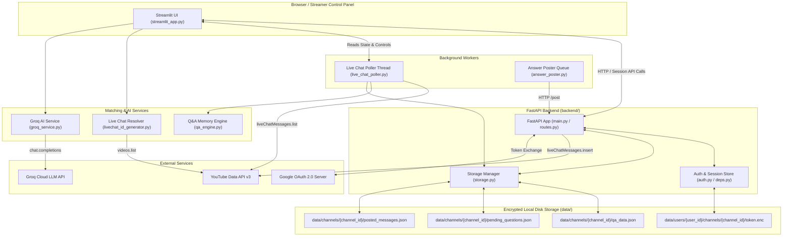
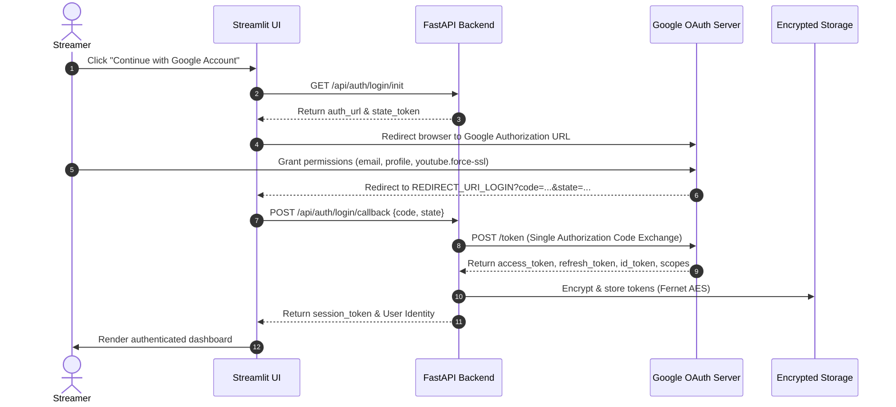

# Technical Architecture and Workflow Guide

**Last analyzed:** 2026-10-02  
**Repository:** `D:\work\Comment-analyzer`

---

## System Overview

### Plain-Language Overview
Stream Assistant AI is a virtual co-host for YouTube live streamers. When a streamer goes live, the app listens to incoming viewer chat messages in real time. If viewers ask questions (like "What camera are you using?" or "Where is the link?"), the app compares the question against a pre-approved list of answers provided by the streamer. 

If an exact or very close answer is found, the app can automatically reply in the live chat or suggest the answer for the streamer to approve with one click. If the question is brand new, it appears in a "New Questions" list on the streamer's control panel. The streamer can type an answer, save it for future streams, and immediately post it to YouTube Live Chat.

### Technical System Overview
The application is built as a decoupled two-tier system:
1. **Frontend (Streamlit UI)**: Handles presentation, real-time control panel rendering, fragment auto-refreshing (every 2 seconds), and user action dispatching.
2. **Backend (FastAPI & Services)**: Handles authentication, OpenID identity token parsing, Fernet AES token encryption, YouTube Data API v3 integration, polling loops, VADER sentiment scoring, lexical Jaccard Q&A matching, Groq AI drafting, and single-writer posting queues.

---

## Architecture Diagram



---

## Component Responsibilities

| Component / File | Responsibility | Inputs | Outputs | Dependencies | Notes & Limitations |
| :--- | :--- | :--- | :--- | :--- | :--- |
| `streamlit_app.py` | Control panel UI rendering, fragment auto-refresh, sidebar control | User interactions, `AssistantState` snapshot | Rendered UI, API requests | Streamlit, Requests | Renders UI; delegates posting to backend API |
| `backend/main.py` | FastAPI app initialization, middleware, CORS setup | Web requests | ASGI FastAPI application | FastAPI, Uvicorn | Mounts `/api` routes |
| `backend/routes.py` | Auth, OAuth callback, channel discovery, `/post` endpoint | HTTP GET/POST payloads, `x-session-token` | JSON responses, OAuth redirects | FastAPI, Requests, `auth.py` | Performs single OAuth exchange; validates chat IDs |
| `backend/auth.py` | Fernet AES token encryption/decryption, user file storage | Token dictionaries, `user_id`, `channel_id` | Encrypted `.enc` bytes, decrypted dicts | Cryptography (`Fernet`) | Uses `ENCRYPTION_KEY` env var |
| `backend/deps.py` | FastAPI dependency injection for current user & channel validation | Request headers (`x-session-token`), cookies | `UserSessionModel`, channel ID string | FastAPI | Enforces auth on backend routes |
| `backend/storage.py` | Inter-process file locking and directory path resolution | Channel ID, User ID | `Path` objects, file lock context manager | `pathlib`, `filelock` | Ensures safe concurrent file access |
| `backend/oauth_config.py` | Centralized OAuth credentials and redirect URI resolver | Environment variables / `st.secrets` | Configured Client ID, Secret, Redirect URIs | `python-dotenv` | Checks for placeholder credential values |
| `live_chat_poller.py` | Background live chat polling loop, VADER sentiment, question routing | `activeLiveChatId`, YouTube API key | `recent_messages`, `suggestions`, `pending` queue | `google-api-python-client`, NLTK | Enforces quota-friendly polling floor ($\ge 5.0$s) |
| `answer_poster.py` | Single-writer queued answer posting worker | Answer text, `live_chat_id`, `record_id` | Queued post requests to backend API | `queue`, `threading` | Gated by 300s record cooldown & 5s global gap |
| `qa_engine.py` | Approved Q&A memory storage, Jaccard lexical matcher | Raw text strings, Q&A records | Best match `(record, score)`, atomic JSON files | `re`, `json`, `uuid` | Lexical token overlap matcher |
| `groq_service.py` | AI draft generation & answer verification against Q&A memory | Question string, approved Q&A records | Draft answer string or `NO_ANSWER` | Requests (Groq API) | Display-only in UI; never auto-posts |
| `livechat_id_generator.py` | Resolves `activeLiveChatId` and video details from Video ID | YouTube Video ID, API Key | `activeLiveChatId`, channel title, video title | `google-api-python-client` | Requires video to be currently live |

---

## OAuth and Authorization Flow



### OAuth Specifications & Scope Requirements
* **Mandatory Scopes**:
  * `openid`: Authenticates identity via OpenID Connect.
  * `email`: Retrieves host email address.
  * `profile`: Retrieves host display name.
  * `https://www.googleapis.com/auth/youtube.force-ssl`: Required to write messages into YouTube Live Chat.
* **Token Storage**: Encrypted at `data/users/{user_id}/channels/{channel_id}/token.enc`.
* **Token Refresh**: Automatically performed by `/api/channel/{channel_id}/post` when an access token expires (HTTP 401).

---

## Live-Chat Workflow

1. **Host Login**: Host authenticates via Google OAuth; FastAPI backend returns `session_token`.
2. **Channel Selection**: Host selects their verified YouTube channel (`selected_channel_id`).
3. **Video Connection**: Host inputs YouTube live video ID/URL. `livechat_id_generator.py` resolves `activeLiveChatId`.
4. **Assistant Startup**: Host clicks "Start Assistant". `poller.start_assistant()` initializes session state (`live_chat_id`, `video_id`, `generation`) and spawns `poll_loop`.
5. **Message Ingestion**: Poller fetches chat batch via `liveChatMessages().list`.
6. **Filtering & Scoring**:
   * Message ID deduplicated via `IdRing`.
   * Bot names/IDs filtered out.
   * VADER computes compound sentiment score.
   * Heuristic `is_question()` tests for viewer questions.
7. **Routing**:
   * **Score $\ge$ 0.80 & Auto-Reply ON**: Sent to `AnswerPoster`. *(Unverified in live production; verified via mock test suite)*.
   * **0.50 $\le$ Score < 0.79**: Placed in `suggestions` array for manual UI review.
   * **Score < 0.50**: Enqueued in `pending_questions.json` with occurrence metadata.
8. **UI Rendering**: Streamlit UI fragment (`run_every=2`) calls `poller.load_pending(strict_stream_filter=True)` displaying questions for the active stream.
9. **Host Action (Save & Post Now)**:
   * Host reviews question, types response, clicks "Save & Post Now".
   * UI issues POST to `/api/channel/{channel_id}/post`.
   * Backend validates `occurrence_id` and verifies `live_chat_id` matches active stream.
   * Backend decrypts OAuth access token and issues HTTP POST to YouTube `liveChatMessages.insert`. *(Unverified in live production; verified via mock test suite)*.
10. **Record & Update**: On success, backend logs message ID to `posted_messages.json`, updates pending question status to `posted`, and returns YouTube message ID.

---

## API and Storage Map

### Backend REST API Endpoints

| Method | Endpoint Path | Description | Authentication |
| :--- | :--- | :--- | :--- |
| `GET` | `/health` | Server health check endpoint | None |
| `GET` | `/api/auth/login/init` | Generates Google OAuth login authorization URL | None |
| `POST` | `/api/auth/login/callback` | Exchanges authorization code for OpenID identity & tokens | None |
| `GET` | `/api/me` | Fetches current user session profile & channel status | `x-session-token` / Cookie |
| `POST` | `/api/auth/logout` | Invalidates active user session | `x-session-token` |
| `GET` | `/api/oauth/init` | Generates YouTube channel authorization OAuth URL | `x-session-token` |
| `POST` | `/api/oauth/callback` | Exchanges code for YouTube write tokens | `x-session-token` |
| `POST` | `/api/oauth/select_channel` | Binds active session to selected YouTube channel | `x-session-token` |
| `POST` | `/api/oauth/disconnect` | Deletes channel tokens and disconnects channel | `x-session-token` |
| `POST` | `/api/channel/{channel_id}/post` | Validates question occurrence & posts response to YouTube | `x-session-token` |

### Local File Storage Hierarchy

```text
data/
├── channels/
│   └── {channel_id}/
│       ├── cooldowns.json           # Per-record and global posting cooldown timestamps
│       ├── pending_questions.json   # Channel pending question queue and occurrence history
│       ├── posted_messages.json     # Audit log of answers posted to YouTube live chat
│       └── qa_data.json             # Approved Q&A memory bank records
├── logs/
│   └── app.log                      # Application system logs
└── users/
    └── {user_id}/
        └── channels/
            └── {channel_id}/
                └── token.enc        # Fernet AES encrypted OAuth tokens
```

### Identity and Resource ID Separation

* `user_id`: OpenID subject identifier (e.g. `google|123456789`).
* `channel_id`: Streamer's YouTube Channel ID (e.g. `UCxxxxxxxxxxxx`).
* `video_id`: YouTube Live Stream Video ID (e.g. `umkwDoV6lPk`).
* `live_chat_id`: Active Live Chat ID string returned by YouTube API for a live video.
* `question_key`: Normalized lower-case question text string used for aggregation (e.g. `what camera is that`).
* `occurrence_id`: Unique identifier for an individual ask event (e.g. `occ_1_1727800000000`).
* `message_id`: Unique YouTube message ID (e.g. `LGCgTWVzc2FnZUlE...`).

---

## User Journeys

### 1. First-Time User Login
1. User opens Streamlit UI.
2. User clicks **🔐 Continue with Google Account**.
3. User authorizes Google login prompt.
4. User is redirected back to app with session token established.
5. User is prompted to select/connect their YouTube channel.

### 2. Returning User Reconnecting
1. User opens Streamlit UI.
2. App reads existing session cookie / header via `/api/me`.
3. If session is valid, user is taken directly to the main control panel.

### 3. Starting a Stream Assistant
1. User pastes live stream Video ID or URL into sidebar.
2. User clicks **📡 Connect Video Stream** (resolving `activeLiveChatId`).
3. User clicks **▶️ Start Assistant**.
4. Poller thread starts polling live chat; live metrics display `LIVE 🟢`.

### 4. Reviewing a Question
1. Incoming question appears under **🙋 New Questions from Chat**.
2. Expand card to see phrasing examples, occurrences, and ask count.
3. User reads question.

### 5. Saving an Answer for Later Use
1. User types response in **Your Answer Response** text area.
2. User clicks **💾 Save & Approve (Memory Only)**.
3. Record is saved to Q&A Memory Bank (`qa_data.json`) for future automated matching. Question is removed from pending queue.

### 6. Posting an Answer to Live Chat
1. User types response (or clicks **✨ Get AI Draft**).
2. User clicks **🚀 Save & Post Now**.
3. Backend validates active stream `live_chat_id`, decrypts OAuth token, posts message to YouTube Live Chat, and returns confirmation.

### 7. Stopping the Assistant
1. User clicks **🛑 Stop Assistant**.
2. Poller thread joins and stops; session display state clears; status updates to `IDLE ⏸️`.

### 8. Switching to Another Stream
1. User enters new Video ID in sidebar while previous stream is running.
2. App automatically stops previous assistant thread, clears previous stream's visible queue, resolves new `activeLiveChatId`, and starts polling the new stream.

---

## Local Development and Startup

### Prerequisites
* Python 3.14+ (or Python 3.10+)
* Google Cloud Console OAuth 2.0 Web Client credentials
* YouTube Data API Key

### Command Execution Steps

1. **Virtual Environment Setup**:
   ```cmd
   python -m venv .venv
   .venv\Scripts\activate
   ```

2. **Install Dependencies**:
   ```cmd
   pip install -r requirements.txt
   ```

3. **Configure Environment Variables (`.env`)**:
   Create a `.env` file in the project root:
   ```env
   GOOGLE_CLIENT_ID=your_google_client_id.apps.googleusercontent.com
   GOOGLE_CLIENT_SECRET=your_google_client_secret

   YOUTUBE_API_KEY=your_youtube_api_key
   GROQ_API_KEY=your_groq_api_key

   BACKEND_URL=http://localhost:8000
   FRONTEND_URL=http://localhost:8501

   REDIRECT_URI_LOGIN=http://localhost:8000/api/auth/login/callback
   REDIRECT_URI_YOUTUBE=http://localhost:8000/api/oauth/callback

   ENCRYPTION_KEY=my_local_dev_secret_key_12345
   ```

4. **Run Application**:
   ```cmd
   streamlit run streamlit_app.py
   ```
   *(Note: `streamlit_app.py` automatically spawns the Uvicorn backend on `http://127.0.0.1:8000` if it is not already running).*

5. **Run Test Suite**:
   ```cmd
   .venv\Scripts\python.exe -m pytest
   ```

---

## Deployment Notes

### Deployment Architecture (Streamlit Community Cloud)
* **Single Container Setup**: Streamlit Community Cloud runs `streamlit_app.py` on exposed public port `8501`.
* **Internal Backend Server**: `ensure_backend_running()` spawns `uvicorn` on internal address `127.0.0.1:8000` in a background daemon thread.
* **Public Redirect URIs**: Because port `8000` is internal, browser redirect URIs (`REDIRECT_URI_LOGIN` and `REDIRECT_URI_YOUTUBE`) MUST point to the public Streamlit domain (`https://<app-subdomain>.streamlit.app`). Streamlit's `check_auth_token()` receives query parameters from the browser redirect and forwards them to the internal FastAPI backend on `127.0.0.1:8000`.

### Google Cloud OAuth Consent Screen Requirements
* **Testing Mode**: When OAuth Consent Screen is in *Testing* status, developer MUST explicitly add user emails under **Test users** in Google Cloud Console. Unlisted accounts encounter a `403 Access Denied` error page.
* **Production Publishing**: Publishing to External Production requires registering an Authorized Domain, providing a public Homepage URL and Privacy Policy URL, and submitting for Google Verification due to the restricted `youtube.force-ssl` scope.

---

## Glossary

* **OAuth 2.0**: Open standard authorization protocol used to delegate YouTube channel permissions without sharing passwords.
* **Access Token**: Short-lived credential used to authenticate HTTP requests to YouTube Data API v3.
* **Refresh Token**: Long-lived credential used to obtain new access tokens when they expire.
* **YouTube Channel ID**: Unique identifier for a YouTube channel (starts with `UC`).
* **Video ID**: Unique 11-character identifier for a YouTube video/livestream (e.g. `umkwDoV6lPk`).
* **liveChatId**: Unique string identifier assigned by YouTube to an active live chat stream.
* **Question Key**: Normalized lower-case text string used to deduplicate and aggregate repeat questions.
* **Pending Queue**: Collection of unrecognized viewer questions awaiting host review.
* **Streamlit Session State**: In-memory dictionary persistent across re-runs for a single browser tab session in Streamlit.
* **FastAPI Backend**: High-performance Python web framework hosting API routes and token security operations.
* **API Key**: Public key used for unauthenticated read operations (e.g. fetching public video metadata).
* **OAuth Scope**: Permission boundary requested during OAuth authorization (e.g. `youtube.force-ssl`).
