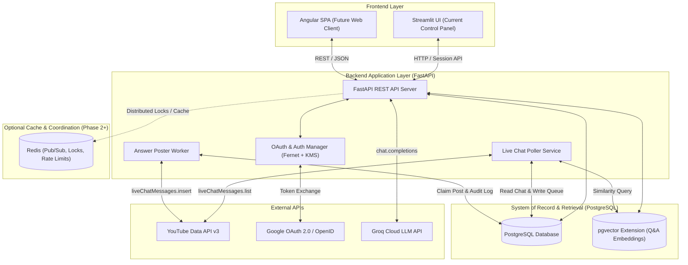
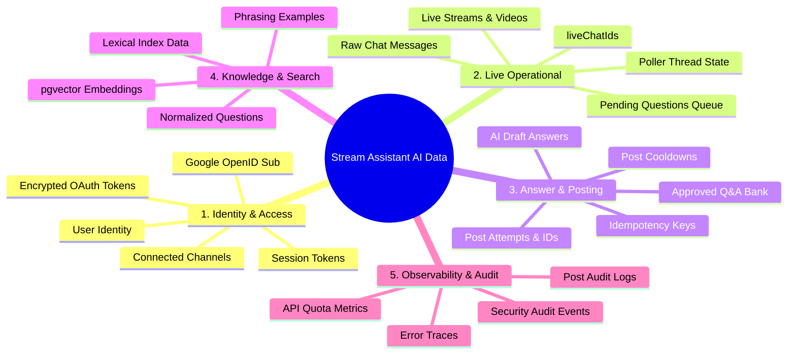
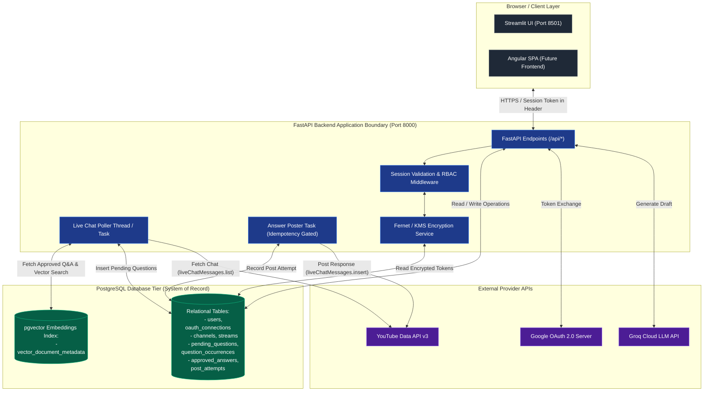
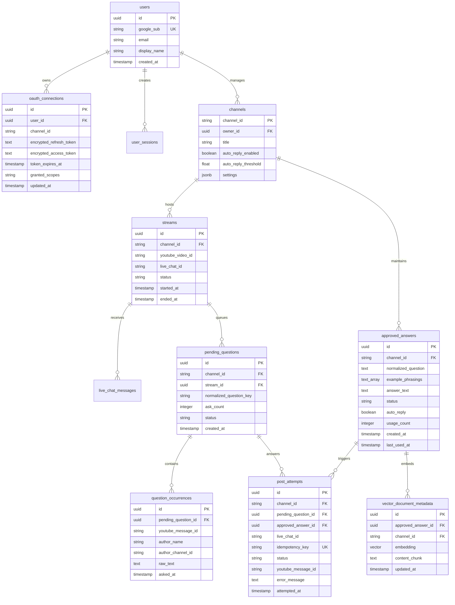
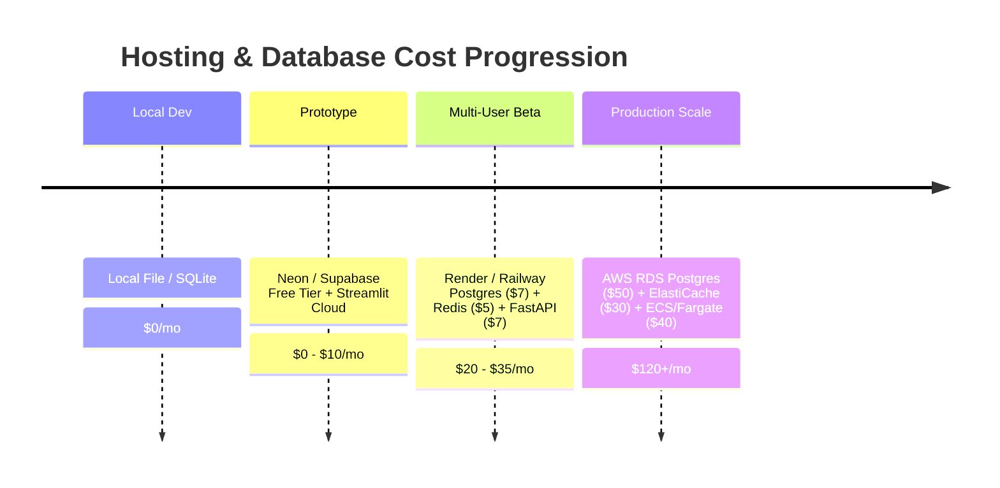

# Data Storage and Deployment Strategy

**Document Version:** 1.0  
**Date:** 2026-10-02  
**Project:** Stream Assistant AI (Comment-analyzer)  
**Author:** AI Architectural Review  
**Status:** Planning & Analysis Document  

---

## 1. Executive Recommendation

### Target Architecture Overview
For target cloud deployment, **Stream Assistant AI** should adopt **Managed PostgreSQL (or Supabase / Neon Postgres)** as its primary, single source of truth for all operational, relational, transactional, and identity data. 

To support enhanced Q&A retrieval beyond the current lexical Jaccard matching, the initial cloud deployment should use **`pgvector` (PostgreSQL vector extension)** rather than a separate vector service like Pinecone. This keeps the data architecture unified, transactionally consistent, low-cost, and straightforward to operate.



### Component Breakdown
* **Operational & Transactional System of Record**: **PostgreSQL** (Managed via Neon, Supabase, AWS RDS, or GCP Cloud SQL). Stores users, OAuth identity connections, channel settings, live stream sessions, chat messages, pending question queues, approved Q&A records, post attempts, idempotency keys, and audit logs.
* **Semantic Vector Search**: **`pgvector` within PostgreSQL**. Stores vector embeddings for approved Q&A pairs and candidate question phrasings directly within the relational database, filtered strictly by `channel_id`.
* **Distributed Caching & Coordination (Phase 2+)**: **Redis** (Managed via Upstash, AWS ElastiCache, or Redis Cloud). Introduced only when scaling horizontally to multiple FastAPI worker processes to handle multi-worker rate limiting, inter-process locks, and background poller job queues.
* **Object Storage**: **Not Required initially**. The application deals purely with structured text, metadata, and JSON payloads. If raw live chat export dumps, system backup snapshots, or exported analytics CSVs are needed in the future, AWS S3, Cloudflare R2, or Google Cloud Storage can be attached.

### Why the Local `data/` Folder is Unsuitable for Cloud Deployment
The existing application currently persists runtime data into a local filesystem hierarchy (`data/channels/{channel_id}/` and `data/users/{user_id}/`). While this pattern is simple and effective for local single-user execution, it presents critical risks in production cloud environments:

1. **Ephemeral Filesystems**: Cloud hosting platforms (Streamlit Community Cloud, AWS Fargate, Google Cloud Run, Heroku, Vercel) use stateless, ephemeral filesystem containers. Any container restart, redeployment, or auto-scaling event permanently wipes all files inside `data/`, losing encrypted OAuth tokens, pending question queues, host settings, and Q&A memory banks.
2. **Multi-User Data Isolation Risks**: File-based storage relies on directory paths (`data/users/{user_id}/channels/{channel_id}/`). In a multi-tenant cloud environment, file path handling introduces potential directory traversal vulnerabilities or race conditions if file locking fails.
3. **No Horizontal Scaling**: Local OS file locks (`O_CREAT | O_EXCL` in `backend/storage.py`) only work within a single filesystem instance. Multiple backend instances or containers cannot synchronize state via file locks, leading to duplicate posts to YouTube and corrupted JSON files.
4. **Lack of ACID Transactions**: Concurrent writes to JSON files (`atomic_write_json` via `.tmp` swap) risk data loss if two operations attempt to update pending questions or Q&A memory simultaneously.
5. **No Backup / Disaster Recovery**: Local JSON files lack automated point-in-time recovery, replication, or transactional WAL (Write-Ahead Logging) backups.

---

## 2. Current Storage Inventory

The codebase was thoroughly inspected for all existing state mechanisms, local files, and directory structures:

| Current location / file / module | Data stored | Writer(s) | Reader(s) | Lifecycle | Sensitive? | Current risks | Recommended destination |
| :--- | :--- | :--- | :--- | :--- | :--- | :--- | :--- |
| `data/channels/{channel_id}/qa_data.json` | Approved Q&A records, example phrasings, usage counters, timestamps, auto-reply flags | `qa_engine.py` | `qa_engine.py`, `live_chat_poller.py`, `streamlit_app.py` | Persistent per channel | No (Public/Streamer Q&A) | Race conditions on write, full file rewrite on edit, ephemeral wipe on cloud deploy | PostgreSQL table `approved_answers` + `pgvector` index |
| `data/channels/{channel_id}/pending_questions.json` | Pending question queue, normalized question keys, ask counts, occurrence arrays | `live_chat_poller.py` | `live_chat_poller.py`, `streamlit_app.py` | Semi-persistent (per stream/channel) | Low (Viewer chat text) | Ephemeral loss, unindexed scan overhead for large streams | PostgreSQL tables `pending_questions` & `question_occurrences` |
| `data/channels/{channel_id}/posted_log.jsonl` | Audit log of posted answers, YouTube message IDs, post timestamps, question keys | `backend/storage.py`, `backend/routes.py` | Backend logging, audit routines | Append-only persistent | Low | File growth, unindexed search, cloud container wipe | PostgreSQL table `post_attempts` |
| `data/channels/{channel_id}/cooldown.json` | Global and per-record post timestamps | `answer_poster.py`, `backend/routes.py` | `answer_poster.py` | Runtime state | No | In-memory / file mismatch across processes | PostgreSQL table `post_idempotency_keys` / Redis keys |
| `data/channels/{channel_id}/settings.json` | Channel settings (auto-reply, thresholds) | `streamlit_app.py`, `backend/storage.py` | `streamlit_app.py`, `live_chat_poller.py` | Persistent per channel | No | File overwrite conflict | PostgreSQL table `channels` |
| `data/users/{user_id}/channels/{channel_id}/token.enc` | Encrypted OAuth access & refresh tokens, expiry, scopes | `backend/auth.py` | `backend/routes.py`, `backend/auth.py` | Persistent per user/channel | **YES (CRITICAL)**: Grants YouTube live chat posting rights | Disk compromise if ENCRYPTION_KEY leaks, loss on container restart | PostgreSQL table `oauth_connections` with KMS payload encryption |
| `data/logs/app.log` | Application operational logs | Python `logging` | Developers / Admins | Rotating file | Low (unless errors dump tokens) | Unrotated disk fill, lost on container exit | CloudWatch / Datadog / Standard stdout logging |
| `AssistantState` (`live_chat_poller.py`) | Recent chat feed, Superchat alerts, suggestion queue, poller state, generation counter | `live_chat_poller.py` thread | `streamlit_app.py` UI | In-memory only (wiped on stop/restart) | No | Volatile; lost if background thread crashes | Redis / In-memory state service |
| `backend/routes.py` (`session_tokens`) | Active user session mapping (`session_token` -> `UserSessionModel`) | `backend/routes.py` | `backend/deps.py` | In-memory dict | **YES**: Session bearer tokens | Lost on server restart, cannot share session across multi-process workers | PostgreSQL `user_sessions` table / Redis session store |
| `legacy_backup/` & root `qa_data.json` | Legacy v1 Q&A data files | None (read-only import source) | `qa_engine.py` (`import_legacy_qa`) | Legacy snapshot | No | Outdated file reference | One-time DB seed migration script |
| `.lock` files (`backend/storage.py`) | Cross-process file locks (`.lock` files via `O_CREAT`) | `interprocess_file_lock` | `interprocess_file_lock` | Ephemeral transient | No | Single-node filesystem lock only; breaks in multi-node cloud | PostgreSQL row locks (`SELECT ... FOR UPDATE`) or Redis locks |

*Note: Vector databases, Pinecone SDKs, n8n integrations, or relational databases were confirmed to be absent from the codebase.*

---

## 3. Data Classification

All data handled by Stream Assistant AI is classified into five distinct tiers:



### Classification Deep-Dive

#### 1. Identity and Access Data
* **Items**: Google user IDs (`google|...`), OpenID profile details, connected YouTube channel IDs, encrypted OAuth access/refresh tokens, token expiration timestamps, granted scopes (`youtube.force-ssl`), web session tokens.
* **Durable Storage System**: PostgreSQL (`users`, `oauth_connections`, `user_sessions` tables).
* **Retention Policy**: Retained indefinitely until the user explicitly disconnects their YouTube channel or deletes their account.
* **Encryption Needs**: AES-256-GCM encryption at rest using AWS KMS or GCP KMS for refresh tokens. TLS 1.3 in transit.
* **Indexing Needs**: Primary Key on `user_id`, Unique Index on `(user_id, channel_id)`, Index on `session_token`.
* **Backup Requirements**: Continuous WAL archiving + daily automated encrypted database backups.
* **Access Restrictions**: Restricted strictly to server-side backend logic. Never exposed to browser or Streamlit session state.
* **Revocation Behavior**: On channel disconnect or logout, tokens are revoked via Google OAuth API and securely deleted (`DELETE FROM oauth_connections`).

#### 2. Live-Stream Operational Data
* **Items**: Active stream video ID, `liveChatId`, streamer settings, poller status, raw chat feed buffer, Superchat alerts, pending viewer questions, question occurrence records (`occurrence_id`, `message_id`, author details).
* **Durable Storage System**: PostgreSQL (`streams`, `live_chat_messages`, `pending_questions`, `question_occurrences` tables). Active feed buffers in Redis or in-memory.
* **Retention Policy**: Chat messages: 7–30 days. Pending questions: Retained until host resolves (approves, dismisses, or archives) or stream session expires.
* **Encryption Needs**: Standard database storage encryption at rest.
* **Indexing Needs**: Index on `(channel_id, stream_id)`, Index on `(stream_id, live_chat_id)`, Index on `(pending_question_id, status)`.
* **Backup Requirements**: Standard daily database snapshots.
* **Access Restrictions**: Scoped strictly to the authenticated owner of the `channel_id`.
* **Deletion/Revocation Behavior**: Stream session tear-down marks pending questions as archived when a new stream starts.

#### 3. Answer and Posting Data
* **Items**: Host-approved answers, Groq AI-generated draft answers, post attempt history, YouTube response message IDs, post execution states (`pending`, `in_flight`, `posted`, `failed`, `outcome_unknown`), idempotency keys, error details.
* **Durable Storage System**: PostgreSQL (`approved_answers`, `post_attempts`, `post_idempotency_keys` tables).
* **Retention Policy**: Approved Q&A: Permanent (until edited/deleted by host). Post history & idempotency keys: 90 days.
* **Encryption Needs**: Encryption at rest.
* **Indexing Needs**: Index on `(channel_id, normalized_question)`, Unique Index on `idempotency_key`, Index on `youtube_message_id`.
* **Backup Requirements**: Point-in-time recovery enabled.
* **Access Restrictions**: Channel host only.
* **Deletion/Revocation Behavior**: Soft-delete or hard-delete on host request. Deleting an answer invalidates its vector embedding index entry.

#### 4. Knowledge / Search Data
* **Items**: Normalized question strings, phrasing token sets, text embeddings (vector representations), semantic search score indices.
* **Durable Storage System**: PostgreSQL with `pgvector` extension.
* **Retention Policy**: Synchronized 1:1 with `approved_answers` records.
* **Encryption Needs**: Standard database encryption.
* **Indexing Needs**: `HNSW` (Hierarchical Navigable Small World) or `IVFFlat` vector index on embedding column, combined with B-tree index on `channel_id`.
* **Backup Requirements**: Included in database snapshots; can be regenerated from `approved_answers` text at any time.
* **Access Restrictions**: Read by poller matching thread; write by host Q&A memory updates.
* **Deletion/Revocation Behavior**: Automatic cascade delete when parent `approved_answers` row is deleted.

#### 5. Observability and Audit Data
* **Items**: API request/response logs, YouTube API quota usage counters, post audit log entries, security events, authentication attempt logs.
* **Durable Storage System**: PostgreSQL (`audit_events` table) and Cloud Logging / CloudWatch.
* **Retention Policy**: 90 days for detailed audit logs; 1 year for aggregated operational metrics.
* **Encryption Needs**: Encrypted log storage at rest. Strict log scrubbing (no OAuth tokens, secrets, or PII in logs).
* **Indexing Needs**: Index on `(channel_id, created_at)`, Index on `event_type`.
* **Backup Requirements**: Automated log retention lifecycle policy.
* **Access Restrictions**: System administrators & security monitoring tools.
* **Deletion/Revocation Behavior**: Automated purge via database partition pruning or retention policy.

---

## 4. Database Options Comparison

The following table evaluates database candidates specifically for the Stream Assistant AI workload:

| Option | Suitable for | Not suitable for | Concurrency / transactions | Semantic search | OAuth / token storage suitability | Multi-user deployment suitability | Cost / operational complexity | Recommendation |
| :--- | :--- | :--- | :--- | :--- | :--- | :--- | :--- | :--- |
| **Local JSON files / Current `data/` folder** | Single-user local testing, zero-config prototypes | Cloud deployment, multi-user, horizontal scaling | Poor (file locks only, risk of corruption) | Basic (Jaccard lexical overlap only) | Low (File exposure risk, lost on restart) | Unsuitable | Low cost, high operational risk in cloud | **Local Dev Only** |
| **SQLite** | Embedded tools, desktop apps, single-instance dev | Multi-region cloud, concurrent web workers | Fair (Single writer lock via WAL) | Limited (requires third-party extensions) | Moderate | Low (Not designed for distributed web backends) | Low cost, low operational complexity | **Local / Testing Only** |
| **PostgreSQL / Managed Postgres** | System of record, relational data, transactional ACID integrity | Unstructured high-throughput logs | **Excellent** (Full ACID, row locking) | Excellent via `pgvector` | **High** (Encrypted columns, strict access control) | **Excellent** (Tenant isolation via schemas or `channel_id` columns) | Moderate cost ($0–$25/mo for managed instances), standard ops | **PRIMARY RECOMMENDATION (System of Record)** |
| **Supabase (Postgres)** | Full-stack Postgres, auth, real-time subscriptions, pgvector | Apps requiring pure unmanaged database control | **Excellent** (Native Postgres engine) | Native via `pgvector` | **High** | **Excellent** | Low start ($0 free tier, $25/mo pro), very low ops | **PRIMARY CANDIDATE (Managed Postgres)** |
| **Firebase Firestore** | Mobile-first document sync, basic document queues | Complex SQL joins, relational constraints, vector search | Good (Document transactions) | Poor (Requires external Algolia/Pinecone) | Moderate | Moderate | Pay-per-read/write can scale unpredictably | **Not Recommended** |
| **MongoDB Atlas** | Document storage, flexible JSON schemas | Enforcing strict relational foreign keys & ACID constraints | Good (Document-level ACID) | Available via Atlas Vector Search | Moderate | Good | Moderate to high cost | **Not Recommended** |
| **Pinecone** | Dedicated ultra-high-scale standalone vector indexing | System of record, relational data, OAuth tokens, sessions | Poor (Vector database only, no ACID relational support) | **Excellent** (Specialized vector index) | **UNSUITABLE** (Must never store secrets/tokens) | Poor as standalone; requires secondary SQL database | High cost ($70+/mo for dedicated pods), high architecture complexity | **NOT RECOMMENDED AT THIS STAGE** |
| **Postgres + pgvector** | **Unified relational system of record + vector similarity** | Extremely large-scale vector search (>100M vectors) | **Excellent** | **Excellent** (Sufficient for Q&A matching) | **High** | **Excellent** | Low additional cost (runs inside Postgres instance) | **RECOMMENDED VECTOR RETRIEVAL CHOICE** |
| **Postgres + Pinecone Hybrid** | Very large enterprises requiring dedicated vector pod isolation | Early-stage / mid-scale multi-user SaaS | Excellent (Relational in Postgres, vectors in Pinecone) | Excellent | High (Postgres holds tokens; Pinecone holds vectors) | Excellent | High cost & duplicate data synchronization overhead | **Future Scale-out Only** |
| **Redis** | In-memory caching, rate-limiting, distributed locks, session store | Primary persistent system of record | High speed key-value | Limited (RedisSearch available but extra) | Moderate (Transient sessions only) | Excellent (Shared memory layer across workers) | Low ($0–$10/mo managed) | **RECOMMENDED FOR PHASE 2 (Cache/Locks)** |
| **Object Storage (S3 / R2 / GCS)** | Large blob storage, raw stream transcript exports, backups | Transactional database queries, random updates | N/A (Object store) | N/A | Low | High for public assets/exports | Low cost ($0.015/GB) | **Optional (Backups & Exports Only)** |

### Critical Architecture Clarifications
1. **Pinecone is NOT a System of Record**: Pinecone is a vector similarity index. It must **never** be used to store OAuth tokens, user session state, pending question queues, YouTube API post history, or channel settings.
2. **Postgres + pgvector Eliminates Early Pinecone Need**: `pgvector` allows PostgreSQL to run vector similarity queries (e.g. `ORDER BY embedding <=> query_embedding LIMIT 1`) directly alongside SQL filters (`WHERE channel_id = :channel_id`). This completely avoids managing a second database cluster, reduces cloud billing costs, and guarantees ACID consistency when Q&A records are edited or deleted.

---

## 5. Recommended Target Architecture

The recommended target cloud architecture isolates the database tier, keeping all credentials, OAuth tokens, and YouTube operations securely on the server side:



### Key Security & Boundary Principles
* **Server-Side Token Isolation**: OAuth access tokens and refresh tokens are decrypted strictly inside backend RAM during a post execution. They are never sent to the browser, Streamlit state, or logged to disk.
* **No Direct DB Access**: Frontend applications (Streamlit or Angular) never communicate directly with PostgreSQL. All data access occurs via authenticated FastAPI REST endpoints (`/api/...`).
* **Tenant Isolation**: Every database query, vector search, and posting action is strictly gated by the authenticated user's `user_id` and selected `channel_id`.
* **Vector Index Boundary**: The `pgvector` embedding table stores vector float arrays and answer references only; it never stores OAuth tokens, user credentials, or private credentials.

---

## 6. Proposed Relational Schema

Below is the practical, production-ready PostgreSQL relational schema designed to replace the current `data/` file structure.



### Detailed Table Design Specifications

#### 1. `users`
* **Primary Key**: `id` (`UUID`, `DEFAULT gen_random_uuid()`)
* **Core Fields**: `google_sub` (`VARCHAR(255)`, UNIQUE, NOT NULL), `email` (`VARCHAR(255)`), `display_name` (`VARCHAR(255)`), `created_at` (`TIMESTAMPTZ`, `DEFAULT NOW()`).
* **Indexes**: Unique Index on `google_sub`, Index on `email`.
* **Sensitive Columns**: `google_sub` (PII identifier).

#### 2. `oauth_connections`
* **Primary Key**: `id` (`UUID`, `DEFAULT gen_random_uuid()`)
* **Core Fields**: `user_id` (`UUID`, FK -> `users.id` ON DELETE CASCADE), `channel_id` (`VARCHAR(64)`, NOT NULL), `encrypted_refresh_token` (`TEXT`, NOT NULL), `encrypted_access_token` (`TEXT`), `token_expires_at` (`TIMESTAMPTZ`), `granted_scopes` (`TEXT`), `updated_at` (`TIMESTAMPTZ`).
* **Foreign Keys**: `user_id` references `users(id)`.
* **Constraints**: UNIQUE `(user_id, channel_id)`.
* **Indexes**: Index on `(user_id, channel_id)`.
* **Sensitive Columns**: `encrypted_refresh_token`, `encrypted_access_token` (**Must be KMS/Fernet encrypted at rest**).

#### 3. `user_sessions`
* **Primary Key**: `id` (`UUID`, `DEFAULT gen_random_uuid()`)
* **Core Fields**: `session_token` (`VARCHAR(255)`, UNIQUE, NOT NULL), `user_id` (`UUID`, FK -> `users.id`), `selected_channel_id` (`VARCHAR(64)`), `expires_at` (`TIMESTAMPTZ`, NOT NULL), `created_at` (`TIMESTAMPTZ`).
* **Indexes**: Unique Index on `session_token`, Index on `(user_id, expires_at)`.
* **Retention**: Expired sessions automatically purged daily via cron / cleanup job.

#### 4. `channels`
* **Primary Key**: `channel_id` (`VARCHAR(64)`)
* **Core Fields**: `owner_id` (`UUID`, FK -> `users.id`), `title` (`VARCHAR(255)`), `auto_reply_enabled` (`BOOLEAN`, `DEFAULT false`), `auto_reply_threshold` (`FLOAT`, `DEFAULT 0.80`), `settings` (`JSONB`, `DEFAULT '{}'::jsonb`), `updated_at` (`TIMESTAMPTZ`).
* **Foreign Keys**: `owner_id` references `users(id)`.

#### 5. `streams`
* **Primary Key**: `id` (`UUID`, `DEFAULT gen_random_uuid()`)
* **Core Fields**: `channel_id` (`VARCHAR(64)`, FK -> `channels.channel_id`), `youtube_video_id` (`VARCHAR(32)`, NOT NULL), `live_chat_id` (`VARCHAR(255)`, NOT NULL), `status` (`VARCHAR(32)`, `DEFAULT 'active'`), `started_at` (`TIMESTAMPTZ`), `ended_at` (`TIMESTAMPTZ`).
* **Indexes**: Index on `(channel_id, live_chat_id)`, Index on `(youtube_video_id)`.

#### 6. `pending_questions`
* **Primary Key**: `id` (`UUID`, `DEFAULT gen_random_uuid()`)
* **Core Fields**: `channel_id` (`VARCHAR(64)`, FK -> `channels.channel_id`), `stream_id` (`UUID`, FK -> `streams.id`), `live_chat_id` (`VARCHAR(255)`, NOT NULL), `normalized_question_key` (`TEXT`, NOT NULL), `ask_count` (`INTEGER`, `DEFAULT 1`), `status` (`VARCHAR(32)`, `DEFAULT 'pending'`), `created_at` (`TIMESTAMPTZ`), `updated_at` (`TIMESTAMPTZ`).
* **Constraints**: UNIQUE `(channel_id, stream_id, normalized_question_key)`.
* **Indexes**: Index on `(channel_id, stream_id, status)`.
* **Isolation Guarantee**: Scoped strictly to `(channel_id, stream_id)`. Questions from previous streams will not match current stream queries.

#### 7. `question_occurrences`
* **Primary Key**: `id` (`UUID`, `DEFAULT gen_random_uuid()`)
* **Core Fields**: `pending_question_id` (`UUID`, FK -> `pending_questions.id` ON DELETE CASCADE), `youtube_message_id` (`VARCHAR(255)`), `author_name` (`VARCHAR(255)`), `author_channel_id` (`VARCHAR(64)`), `raw_text` (`TEXT`, NOT NULL), `asked_at` (`TIMESTAMPTZ`).
* **Indexes**: Index on `(pending_question_id, asked_at)`.

#### 8. `approved_answers`
* **Primary Key**: `id` (`UUID`, `DEFAULT gen_random_uuid()`)
* **Core Fields**: `channel_id` (`VARCHAR(64)`, FK -> `channels.channel_id`), `normalized_question` (`TEXT`, NOT NULL), `example_phrasings` (`JSONB`, `DEFAULT '[]'::jsonb`), `answer_text` (`TEXT`, NOT NULL), `status` (`VARCHAR(32)`, `DEFAULT 'approved'`), `auto_reply` (`BOOLEAN`, `DEFAULT false`), `usage_count` (`INTEGER`, `DEFAULT 0`), `created_at` (`TIMESTAMPTZ`), `updated_at` (`TIMESTAMPTZ`), `last_used_at` (`TIMESTAMPTZ`).
* **Constraints**: UNIQUE `(channel_id, normalized_question)`.
* **Indexes**: Index on `(channel_id, status)`.

#### 9. `post_attempts`
* **Primary Key**: `id` (`UUID`, `DEFAULT gen_random_uuid()`)
* **Core Fields**: `channel_id` (`VARCHAR(64)`, FK -> `channels.channel_id`), `pending_question_id` (`UUID`, FK -> `pending_questions.id`), `approved_answer_id` (`UUID`, FK -> `approved_answers.id`), `live_chat_id` (`VARCHAR(255)`, NOT NULL), `idempotency_key` (`VARCHAR(255)`, UNIQUE, NOT NULL), `status` (`VARCHAR(32)`, `NOT NULL`), `youtube_message_id` (`VARCHAR(255)`), `error_message` (`TEXT`), `attempted_at` (`TIMESTAMPTZ`, `DEFAULT NOW()`).
* **Constraints**: Unique `idempotency_key`. Post state machine values: `pending`, `in_flight`, `posted`, `failed`, `outcome_unknown`.
* **Critical Rule**: Posts with state `outcome_unknown` must **never** be retried automatically to prevent duplicate chat spam.

#### 10. `vector_document_metadata`
* **Primary Key**: `id` (`UUID`, `DEFAULT gen_random_uuid()`)
* **Core Fields**: `approved_answer_id` (`UUID`, FK -> `approved_answers.id` ON DELETE CASCADE), `channel_id` (`VARCHAR(64)`, FK -> `channels.channel_id`), `embedding` (`vector(384)` or `vector(1536)`), `content_chunk` (`TEXT`), `updated_at` (`TIMESTAMPTZ`).
* **Indexes**: HNSW Index on `embedding vector_cosine_ops`, Index on `(channel_id)`.

---

## 7. Semantic Q&A Storage Decision

### Key Questions Answered

#### 1. Does Stream Assistant AI genuinely need Pinecone right now?
**No.** Pinecone is unnecessary for the current scale of the application. 
* A typical YouTube channel maintains between 50 and 2,000 approved Q&A records in their memory bank.
* At this scale, vector similarity queries over a single channel's Q&A set execute in **under 2 milliseconds** inside PostgreSQL using `pgvector`.
* Introducing Pinecone adds external API latency, subscription costs ($70+/month), and data sync complexity without performance benefit.

#### 2. Can PostgreSQL plus `pgvector` provide a simpler, better first deployment?
**Yes.** `pgvector` runs inside the exact same PostgreSQL database holding operational data. 
* Benefits include single-transaction updates, zero external service dependencies, automated point-in-time backups, and unified SQL queries joining embeddings with relational metadata.

#### 3. What data should be embedded?
* The `normalized_question` text and all entries in `example_phrasings` from `approved_answers`.

#### 4. What metadata must accompany each embedding?
* `channel_id`: MANDATORY for tenant filtering.
* `approved_answer_id`: Foreign key referencing the actual answer record.
* `status`: Filters out draft records (`status = 'approved'`).

#### 5. How should embeddings be filtered to prevent cross-user Q&A leakage?
Every vector query **MUST** include a strict SQL `WHERE channel_id = :channel_id` clause:
```sql
SELECT aa.id, aa.answer_text, 1 - (v.embedding <=> :query_vector) AS similarity_score
FROM vector_document_metadata v
JOIN approved_answers aa ON v.approved_answer_id = aa.id
WHERE v.channel_id = :current_channel_id
  AND aa.status = 'approved'
ORDER BY v.embedding <=> :query_vector
LIMIT 1;
```

#### 6. When would Pinecone become worthwhile?
Pinecone would only become worthwhile if:
* The application grows to tens of thousands of active channels with millions of vectors.
* Vector search throughput requires dedicated vector search nodes offloaded from the primary relational database CPU.

#### 7. How are deleted or revised answers updated in vector storage?
* In `pgvector`, database foreign key `ON DELETE CASCADE` constraints automatically delete vector rows when an `approved_answers` row is deleted. Updates trigger an automatic re-embedding background job.

#### 8. What is the single source of truth if vector data becomes inconsistent?
* **`approved_answers` in PostgreSQL is ALWAYS the primary source of truth.** If vector indexes are corrupted or out of sync, a background script can re-generate embeddings for all approved answers.

### Final Decision Recommendation
**Recommendation Option A: PostgreSQL + `pgvector` first. No Pinecone initially.**

---

## 8. Migration Strategy from `data/` Folder

A safe 8-phase migration plan to move from local files to PostgreSQL without service interruption:

```mermaid
flowchart LR
    P0["Phase 0: Backup & Inventory"] --> P1["Phase 1: Repository Interface Layer"]
    P1 --> P2["Phase 2: Database Schema & Alembic"]
    P2 --> P3["Phase 3: Staging Data Import"]
    P3 --> P4["Phase 4: Dual-Read Verification"]
    P4 --> P5["Phase 5: DB Primary Writes"]
    P5 --> P6["Phase 6: pgvector Indexing"]
    P6 --> P7["Phase 7: Retire JSON Files"]
```



### Migration Phases Specification

#### Phase 0: Backup and Inventory
* **Goal**: Take full snapshots of all production `data/` folders (`qa_data.json`, `pending_questions.json`, `token.enc`, `posted_log.jsonl`).
* **Impacted Files**: None (read-only script execution).
* **Validation**: SHA-256 checksum verification of backup archives.
* **Outage Needed**: No.

#### Phase 1: Repository Interface Layer (Code Refactoring)
* **Goal**: Introduce a Storage Abstract Base Class (`BaseRepository`) with two implementations: `JSONFileRepository` (current) and `PostgresRepository` (new).
* **Impacted Files**: `qa_engine.py`, `live_chat_poller.py`, `answer_poster.py`, `backend/storage.py`, `backend/auth.py`.
* **Validation**: Run existing pytest suite against `JSONFileRepository` to ensure zero regressions.
* **Outage Needed**: No.

#### Phase 2: Create Database Schema and Alembic Migrations
* **Goal**: Deploy PostgreSQL database instance (local dev / staging) and run initial Alembic migrations to create tables and `pgvector` extensions.
* **Impacted Files**: New `alembic/` folder, `backend/database.py`, `backend/models_db.py`.
* **Validation**: Run schema verification unit tests.
* **Outage Needed**: No.

#### Phase 3: Staging Data Import Script
* **Goal**: Write an idempotent migration script (`scripts/migrate_json_to_postgres.py`) that parses JSON files and encrypted tokens from `data/` and imports them into PostgreSQL.
* **Impacted Files**: New script file under `scripts/`.
* **Validation**: Query staging PostgreSQL tables and compare counts, JSON structures, and token decryptions against source files.
* **Outage Needed**: No.

#### Phase 4: Dual-Read & Verification Mode
* **Goal**: Configure backend to write to JSON (primary) and shadow-write to PostgreSQL, while comparing read results between both engines. Log any mismatches.
* **Impacted Files**: `backend/repository_factory.py`.
* **Validation**: Monitor application logs for 48 hours to confirm zero read/write discrepancies.
* **Outage Needed**: No.

#### Phase 5: Move Primary Writes to Database
* **Goal**: Switch feature toggle so PostgreSQL becomes the primary target for reads and writes. Maintain JSON fallback export.
* **Impacted Files**: `.env` configuration (`STORAGE_BACKEND=postgres`).
* **Validation**: End-to-end integration testing of login, live chat polling, Q&A matching, and YouTube posting.
* **Rollback Plan**: Revert `STORAGE_BACKEND=json` in `.env` if errors occur.
* **Outage Needed**: Brief 5-minute maintenance window to perform final JSON sync.

#### Phase 6: Enable `pgvector` Semantic Indexing
* **Goal**: Populate `vector_document_metadata` table for all approved Q&A records and enable vector similarity matching in `qa_engine.py`.
* **Validation**: Verify that vector similarity queries score syntactically rephrased questions accurately ($\ge 0.80$).
* **Outage Needed**: No.

#### Phase 7: Retire Local JSON Files
* **Goal**: Disable JSON file dual-writes, remove legacy disk lock code (`interprocess_file_lock`), archive `data/` folder, and run purely on PostgreSQL.
* **Validation**: Full regression test suite pass.
* **Outage Needed**: No.

---

## 9. Security, Privacy, and Compliance Plan

### 1. OAuth Refresh Token Protection
* **Fernet + KMS Envelope Encryption**: OAuth refresh tokens must be encrypted using AES-256-GCM before writing to `oauth_connections`. The master encryption key must be managed by AWS KMS, GCP KMS, or a secure environment secret manager (`ENCRYPTION_KEY`).
* **Token Access Isolation**: Decryption occurs exclusively in backend memory immediately prior to issuing a YouTube API token refresh. Decrypted tokens are never stored in database columns or memory caches.

### 2. Encryption in Transit and at Rest
* **In Transit**: Mandatory TLS 1.3 for all HTTP connections between frontend, backend, database, and external APIs (Google OAuth, YouTube Data API, Groq).
* **At Rest**: PostgreSQL storage volumes must have cloud provider disk encryption enabled (AES-256).

### 3. Tenant Data Isolation
* **Query-Level Scoping**: All SQL statements executed by backend services must explicitly include `WHERE channel_id = :channel_id`.
* **Optional Row-Level Security (RLS)**: In PostgreSQL, RLS policies can be attached to `pending_questions`, `approved_answers`, and `oauth_connections` to guarantee that database connections authenticated as a specific channel tenant cannot read or write another tenant's rows.

### 4. User Disconnect & Data Purge (GDPR / Google OAuth Compliance)
* When a host clicks **Disconnect Channel** or revokes access:
  1. Revoke tokens via `https://oauth2.googleapis.com/revoke`.
  2. Perform cascading delete: `DELETE FROM oauth_connections WHERE user_id = :user_id AND channel_id = :channel_id`.
  3. Purge user session records from `user_sessions`.

### 5. Audit Logging Without Secrets
* Post history audit records (`post_attempts`) log operational metadata only (`attempted_at`, `live_chat_id`, `youtube_message_id`, `status`). Raw OAuth tokens, authorization codes, and client secrets are strictly sanitized from log outputs.

---

## 10. Deployment Implications

### Ephemeral Storage Risks on Cloud Platforms
* Platforms like Streamlit Cloud, AWS Fargate, Google Cloud Run, and Heroku deploy applications inside stateless ephemeral container instances. 
* Local storage in `data/` is wiped every time a container restarts or deploys. Managed PostgreSQL is mandatory for state persistence across container lifecycles.

### Independent Frontend & Backend Deployment
* The backend (`FastAPI`) and frontend (`Streamlit` or `Angular`) can be deployed independently:
  * **FastAPI Backend**: Deployed on Google Cloud Run, AWS App Runner, or Render, connected to Managed Postgres via secure `DATABASE_URL`.
  * **Streamlit / Angular Frontend**: Deployed on Streamlit Cloud or Cloudflare Pages, communicating with FastAPI via HTTPS REST calls.

### Background Poller State & Distributed Locks
* In single-instance setups, `live_chat_poller.py` runs as an in-memory background thread.
* In multi-instance horizontally scaled deployments, background polling jobs should be offloaded to an asynchronous task queue (e.g. Celery, ARQ, or Redis Queue) using Redis for distributed lock coordination (`redis-py` locks) to ensure only **one** active poller thread runs per live stream.

---

## 11. Cost and Phased Recommendation

Below is a practical cost progression from local development to production scale:



### Stage Breakdown

#### 1. Local Development (Current)
* **Storage**: Local JSON files (`data/`) / SQLite.
* **Vector**: Lexical Jaccard in `qa_engine.py`.
* **Cost**: **$0 / month**.

#### 2. First Deployed Prototype (Streamlit Cloud + Free Cloud DB)
* **Database**: Managed Postgres on **Neon.tech** or **Supabase** (Free Tier: 500MB DB, includes `pgvector`).
* **Hosting**: Streamlit Cloud (Free Tier).
* **Cost**: **$0 – $10 / month**.

#### 3. Multi-User Beta (Staging Cloud Environment)
* **Database**: Managed Postgres (Neon / Supabase Pro - $25/mo).
* **Cache/Locks**: Upstash Redis (Free / $5/mo).
* **Backend**: FastAPI on Render / Railway ($7/mo).
* **Cost**: **$20 – $40 / month**.

#### 4. High-Availability Production Scale
* **Database**: AWS RDS PostgreSQL (Multi-AZ, `pgvector` enabled) or GCP Cloud SQL ($50–$100/mo).
* **Cache**: AWS ElastiCache Redis / Upstash ($30/mo).
* **Compute**: AWS ECS Fargate or Cloud Run ($40–$100/mo).
* **Cost**: **$120+ / month**.

---

## 12. Decision Checklist

Use this checklist before provisioning cloud storage providers:

- [ ] **Expected User Count**: Is the app handling $< 100$ channels (Single Postgres DB instance) or $> 10,000$ channels (DB connection pooling with PgBouncer required)?
- [ ] **Chat Velocity & Volume**: What is the peak chat rate? (Postgres handles $5,000+$ write transactions/sec easily; high-velocity chat logs should be buffered in Redis).
- [ ] **Data Retention Policy**: Have chat retention limits (e.g., 30-day purge for raw chat logs) been configured?
- [ ] **Budget Limits**: Has a free tier (Neon / Supabase) been chosen for prototype launch to keep costs near $0?
- [ ] **Hosting Region**: Is the PostgreSQL database provisioned in the exact same cloud region (e.g. `us-east-1`) as the FastAPI backend to minimize network latency?
- [ ] **Semantic Search Requirement**: Is `pgvector` enabled on the PostgreSQL instance (`CREATE EXTENSION IF NOT EXISTS vector;`)?
- [ ] **Multi-User Tenant Isolation**: Are all SQL statements and repository interfaces gated by `channel_id`?
- [ ] **Encryption Key Security**: Is `ENCRYPTION_KEY` set via secure cloud secret manager (not committed to git)?
- [ ] **Backup Verification**: Are automated daily snapshots and point-in-time recovery (PITR) enabled on the managed Postgres cluster?

---

## 13. Final Recommendation

### 1. Recommended First Deployment Architecture
Deploy a **FastAPI backend** connected to a **Managed PostgreSQL database (via Supabase or Neon)** with the **`pgvector` extension** enabled. 
* Use PostgreSQL as the single system of record for users, OAuth tokens, channel settings, pending queues, approved Q&A, post attempts, and vector embeddings.
* Keep the current Streamlit UI as the initial control panel, communicating with FastAPI via HTTPS.

### 2. Recommended Future Scaling Architecture
As the user base expands:
* Migrate the host control panel to an **Angular Single-Page Application (SPA)**.
* Add **Redis** (via Upstash or ElastiCache) for distributed session caching, background poller locks, and posting rate-limit enforcement.
* Scale FastAPI horizontally across stateless container instances (AWS ECS or GCP Cloud Run).

### 3. Top Five Immediate Technical Steps
1. **Define Database Repository Abstraction**: Refactor `qa_engine.py`, `live_chat_poller.py`, and `backend/auth.py` behind a clean repository interface (`BaseRepository`).
2. **Setup Alembic Database Migrations**: Add `alembic` and `SQLAlchemy` / `SQLModel` to `requirements.txt` and generate initial PostgreSQL table migrations.
3. **Provision Prototype Database**: Spin up a free-tier managed Postgres instance on Neon or Supabase and enable `pgvector`.
4. **Create Data Migration Script**: Implement `scripts/migrate_json_to_postgres.py` to transfer existing `data/` JSON records into PostgreSQL.
5. **Enforce Server-Side KMS Token Encryption**: Replace static `ENCRYPTION_KEY` file encryption with managed cloud key manager encryption for OAuth tokens.

### 4. Definitive Statement on Pinecone
> **Do NOT use Pinecone now.**  
> Pinecone is unnecessary for Stream Assistant AI at this stage. Storing Q&A vector embeddings inside **PostgreSQL using `pgvector`** provides superior transaction safety, simpler architecture, lower latency, zero cross-service sync bugs, and significantly lower cloud hosting costs. Re-evaluate Pinecone only if the platform grows beyond 100,000 active channels and tens of millions of Q&A vectors.
