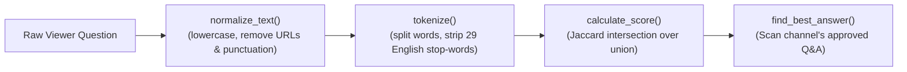
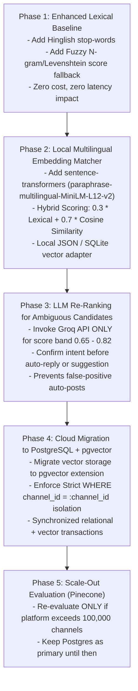
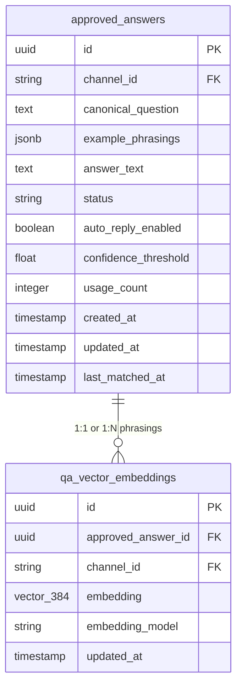

# Semantic Q&A Matching Strategy

**Document Version:** 1.0  
**Last Analyzed:** 2026-10-02  
**Project:** Stream Assistant AI (`D:\work\Comment-analyzer`)  
**Status:** Architecture & Implementation Roadmap (Analysis and Design Only)  

---

> [!IMPORTANT]
> **Implementation Safeguard Notice**: This document is an architectural analysis and implementation recommendation only. No project code, dependencies, `.env` variables, database accounts, or storage files have been modified or created during this analysis.

---

## 1. Current Matching Analysis

### Current Implementation Overview
In the current codebase ([qa_engine.py](file:///D:/work/Comment-analyzer/qa_engine.py)), Q&A matching is performed by `find_best_answer()` using a purely lexical token-overlap method based on the **Jaccard Similarity Coefficient**:

$$\text{Jaccard}(A, B) = \frac{|A \cap B|}{|A \cup B|}$$



### Step-by-Step Breakdown of `qa_engine.py`

1. **Normalization (`normalize_text`)**:
   - Converts input text to lowercase.
   - Strips HTTP/HTTPS URLs and `www.` links.
   - Removes all non-alphanumeric characters using regex `[^a-z0-9\s]`.
   - Collapses multiple whitespace characters into single spaces.
2. **Tokenization (`tokenize`)**:
   - Splits the normalized string by whitespace into a set of unique word tokens.
   - Filters out a fixed set of 29 English stop-words (`a`, `an`, `and`, `are`, `is`, `the`, `to`, `of`, `in`, `on`, `for`, `do`, `does`, `you`, `your`, `i`, `we`, `it`, `what`, `which`, `who`, `how`, `where`, `when`, `why`, `please`, `can`, `could`).
3. **Scoring (`calculate_score`)**:
   - Computes the size of the token intersection divided by the size of the token union between the incoming question and stored `normalized_question`.
   - If either token set is empty after stop-word removal, returns `0.0`.
4. **Candidate Matching (`find_best_answer`)**:
   - Iterates through all approved Q&A records for the channel (`status == "approved"`).
   - Returns exact match score `1.0` if normalized strings match completely.
   - Otherwise, returns the record with the highest Jaccard overlap score along with its score `(best_record, best_score)`.

### Why Paraphrases, Hinglish, and Typos Fail

The current matcher fails on paraphrased or multi-lingual viewer questions due to structural limitations of word-set overlap:

1. **Zero Vocabulary Overlap in Paraphrases**:
   - *Stored Question*: `"What time does the stream start?"` $\rightarrow$ Tokens: `{"time", "stream", "start"}`
   - *Viewer Question*: `"When are you going live?"` $\rightarrow$ Tokens: `{"going", "live"}`
   - *Result*: Intersection = $\emptyset$, Score = **`0.0`** (Complete Miss).
2. **Hinglish and Hindi Transliterations**:
   - *Viewer Questions*: `"Stream kab start hoga?"`, `"Live timing kya hai?"`, `"Aaj stream kitne baje shuru hogi?"`
   - Tokens contain Romanized Hindi words (`kab`, `hoga`, `kya`, `hai`, `kitne`, `baje`, `shuru`, `hogi`). None of these exist in English Q&A records, driving overlap scores below the $0.50$ threshold.
3. **Lack of Stemming, Lemmatization, or Typo Tolerance**:
   - Words like `"camera"` and `"cameras"`, or `"strem"` and `"stream"` are treated as entirely distinct tokens. `"strem schedule"` shares 0 tokens with `"stream schedule"`.
4. **English-Only Stop-Word Filtering**:
   - Common Hindi filler words (`kya`, `hai`, `ho`, `ka`, `ke`, `bhi`, `par`) are not filtered out during tokenization, skewing set union denominators and artificially suppressing match scores.
5. **Role of Existing Groq / AI Integration**:
   - `groq_service.py` is currently **disconnected from real-time chat routing in `live_chat_poller.py`**. It is only invoked on-demand when a streamer manually clicks **"Get AI Draft"** in the Streamlit UI. It plays no role in automated question detection or confidence scoring.

### Current Matching Thresholds and Their Operational Impact

In [live_chat_poller.py](file:///D:/work/Comment-analyzer/live_chat_poller.py), incoming questions are routed based on `best_score`:

| Confidence Score Band | Destination | Operational Behavior | Current Problem |
| :--- | :--- | :--- | :--- |
| $\text{Score} \ge 0.80$ | `AnswerPoster` Queue | Auto-replies to YouTube Live Chat (if `auto_reply` toggle is ON) | **Extremely High Miss Rate**: Paraphrased questions almost never reach 0.80 overlap. |
| $0.50 \le \text{Score} < 0.79$ | `state.suggestions` | Displayed in Streamlit UI under "Suggested Responses" for 1-click host review | **Moderate Miss Rate**: Only catches questions sharing $> 50\%$ identical keywords. |
| $\text{Score} < 0.50$ | `pending_questions.json` | Placed in "New Questions" queue for host to type a manual answer | **High Queue Noise**: Hosts must repeatedly type answers for questions already answered in memory. |

### Test Suite Analysis

* **Existing Tests ([test_qa_engine.py](file:///D:/work/Comment-analyzer/test_qa_engine.py) & [test_poller.py](file:///D:/work/Comment-analyzer/test_poller.py))**:
  - Verify exact token overlap (`"which camera do you use"` $\rightarrow 1.0$).
  - Verify zero overlap (`"camera lens"` vs `"lighting setup"` $\rightarrow 0.0$).
  - Verify draft status filtering (drafts excluded from matching).
  - Verify atomic file writes, corrupt file parking, and basic poller band routing ($0.85$ auto-reply vs $0.65$ suggestion vs $0.30$ pending).
* **Missing Test Coverage**:
  - **Zero paraphrase test cases** (e.g. testing whether `"When are you going live?"` matches `"What time does the stream start?"`).
  - **Zero Hinglish / Hindi test cases**.
  - **Zero typo or misspelling tolerance tests**.
  - **Zero cross-channel isolation leakage tests** for vector memory.
  - **Zero semantic false-positive benchmark tests**.

---

## 2. Options Comparison Matrix

Below is a detailed evaluation of architectural approaches to improve Q&A matching:

| Option | Semantic Quality | Multilingual & Hinglish Support | Live-Stream Latency | Cost | Privacy & Security | Complexity | Deployment Suitability | False-Positive Risk | Verdict & Timeline |
| :--- | :--- | :--- | :--- | :--- | :--- | :--- | :--- | :--- | :--- |
| **A. Enhanced Lexical Only** *(Levenshtein + Stemming + Hinglish Stop-words)* | Low (Helps typos/stems; fails true paraphrases) | Poor (Requires manual dictionary rules) | **Ultra-fast** ($< 1\text{ms}$) | **$0** | **100% Private** (Local CPU) | Very Low | Excellent (Local & Cloud) | Low | **Use Now** (Baseline improvement in Phase 1) |
| **B. Groq / LLM Service as Classifier / Re-Ranker** | **Exceptional** (Full semantic context) | **Exceptional** (Handles Hinglish natively) | Moderate to High ($400 - 1500\text{ms}$ per call) | Per-token API cost (Groq tier) | Moderate (Sends chat text to external API) | Low to Medium | Good (Requires API key & network) | Low if prompt is strict | **Use Later** (Phase 3: Guardrail for ambiguous grey-zone matches) |
| **C. Local Embeddings via SentenceTransformers** | **High** (Captures semantic intent) | **High** (With multilingual model like `bge-m3` or `MiniLM-L12`) | Fast ($5 - 20\text{ms}$ CPU batch inference) | **$0** | **100% Private** (Runs in backend RAM) | Medium | Excellent (Bundled in backend container) | Low with calibrated threshold | **RECOMMENDED PRIMARY CHOICE** (Phase 2: Local retriever) |
| **D. Remote Embedding API** *(OpenAI / Google)* | High | High | Moderate ($150 - 400\text{ms}$ network hop) | Per-vector API cost | Low to Moderate (External API transmission) | Low | Good | Low | **Not Recommended** (Local models perform faster for short chat text at $0 cost) |
| **E. PostgreSQL + pgvector** | **High** (Identical to vector model) | **High** (Model dependent) | **Ultra-fast** ($< 2\text{ms}$ indexed DB query) | Low (Included in Postgres hosting) | **100% Private** (Your database) | Medium | **Best for Cloud Deployment** | Low with tenant scoping | **RECOMMENDED DEPLOYMENT TARGET** (Phase 4: Cloud DB) |
| **F. Standalone Vector DB** *(Pinecone)* | High | High | Moderate ($50 - 150\text{ms}$ network hop) | High ($70+/mo) | Moderate (Third-party SaaS vector store) | High | Poor for small datasets | Low | **Do NOT Use Now** (Overkill for $< 100\text{k}$ Q&A records) |

---

## 3. Recommended Staged Design

Rather than introducing heavy cloud services immediately, a **5-Phase Practical Roadmap** is recommended to upgrade matching accuracy incrementally:



### Phase Details

* **Phase 1 (Immediate Baseline)**: Enhance lexical preprocessing in `qa_engine.py` by adding common Hinglish/Hindi stop-words (`kab`, `kya`, `hai`, `ko`, `ho`, `ka`, `ke`) and integrating fuzzy string matching (Levenshtein distance) as a fallback when exact token overlap is low.
* **Phase 2 (Core Local Semantic Engine)**: Introduce a lightweight, CPU-friendly multilingual embedding model (`sentence-transformers/paraphrase-multilingual-MiniLM-L12-v2` or `BAAI/bge-m3`). Compute vector embeddings for approved Q&A records upon creation, and score incoming viewer questions using **Cosine Similarity**. Combine with lexical score using a weighted hybrid formula:
  $$\text{Final Score} = (0.3 \times \text{Lexical Score}) + (0.7 \times \text{Vector Cosine Score})$$
* **Phase 3 (Ambiguous Grey-Zone Guardrail)**: For high-stakes auto-replies, if a candidate's hybrid score falls in the ambiguous range ($0.65 \le \text{Score} < 0.82$), pass the candidate pair to `groq_service.py` for a fast verification check before queueing an auto-reply.
* **Phase 4 (Cloud Database Deployment)**: When deploying to cloud infrastructure, store vector embeddings in PostgreSQL using the `pgvector` extension (`vector_document_metadata` table), enforcing multi-tenant isolation via `channel_id`.
* **Phase 5 (Future Enterprise Scale)**: Reserve Pinecone for future scale if the platform expands beyond 100,000 active streamer channels.

---

## 4. Semantic Matching Safety Design

### Retrieval & Safety Routing Architecture

```mermaid
flowchart TD
    ViewerQuestion["Incoming Viewer Live-Chat Message"] --> Preproc["1. Normalization & Tokenization\n(Strip URLs, Punctuation, Hinglish Stop-words)"]
    Preproc --> TenantGate["2. Channel Tenant Isolation Gate\n(Filter strictly by channel_id)"]
    TenantGate --> VectorSearch["3. Hybrid Similarity Search\n(BM25 Lexical + Cosine Embedding Similarity)"]
    VectorSearch --> ScoreCheck{"4. Evaluate Hybrid Match Score"}

    ScoreCheck -->|< 0.55 (Low Confidence)| PendingQueue["Route to 'New Questions' Queue\n(pending_questions.json / DB)"]
    
    ScoreCheck -->|0.55 <= Score < 0.82 (Ambiguous)| LLMCheck{"5. Groq LLM Verification\n(Is question semantically equivalent?)"}
    LLMCheck -->|Rejected by LLM| PendingQueue
    LLMCheck -->|Confirmed by LLM| SuggestQueue["Route to UI 'Suggested Responses'\n(Manual Host Review)"]

    ScoreCheck -->|>= 0.82 (High Confidence)| AutoToggle{"6. Is auto_reply Enabled\non Record & Channel?"}
    AutoToggle -->|Disabled| SuggestQueue
    AutoToggle -->|Enabled| PostQueue["7. Enqueue to AnswerPoster Worker\n(Post to YouTube Live Chat)"]
```

### Safety & Integrity Rules

1. **Strict Multi-Tenant Scoping**:
   - Vector similarity queries **MUST** contain a hard filter on `channel_id`. Questions and vectors from Channel A can never be retrieved or matched for Channel B.
2. **Conservative Auto-Reply Confidence Floor**:
   - Auto-reply execution requires **Hybrid Score $\ge 0.82$** AND **Record `auto_reply == True`** AND **Global Streamer `auto_reply == True`**.
   - If the top two candidate answers have scores within $0.03$ of each other (ambiguous match conflict), auto-reply is automatically demoted to a manual UI suggestion.
3. **Preservation of Manual Creator Control**:
   - **"Save & Approve (Memory Only)"** adds/updates Q&A memory without posting to chat.
   - **"Save & Post Now"** updates memory AND posts immediately.
   - AI and vector search **NEVER** automatically add new Q&A pairs to memory. Only human streamer actions mutate the Q&A memory bank.
4. **LLM Non-Hallucination Principle**:
   - The LLM (`groq_service.py`) acts strictly as a **classifier / verifier** against creator-approved Q&A text. The LLM is prohibited from inventing facts or generating answers outside the approved Q&A context block.
5. **Privacy & Secret Protection**:
   - Only sanitized plain-text questions and approved answer strings are sent to external LLM services. OAuth tokens, refresh keys, user emails, and internal database IDs are strictly excluded from AI prompts.
6. **Audit & Traceability Logging**:
   - Every matched response (whether auto-posted or suggested) logs retrieval telemetry to `post_attempts`:
     - `matched_answer_id`
     - `retrieval_method` (`hybrid_v1`, `pgvector_cosine`)
     - `hybrid_score`, `vector_score`, `lexical_score`
     - `embedding_model_version`
     - `timestamp`

---

## 5. Embedding Model Recommendation

Below are concrete, high-performing embedding models evaluated for English, Hindi, and Hinglish live chat text:

| Model Name | Type / Hosting | Vector Dim | Multilingual & Hinglish Capability | CPU / RAM Footprint | License / Costs | Why It Fits Stream Assistant AI |
| :--- | :--- | :--- | :--- | :--- | :--- | :--- |
| **`sentence-transformers/paraphrase-multilingual-MiniLM-L12-v2`** | Local (Hugging Face / PyTorch / ONNX) | **384** | **High**: Trained on 50+ languages including Hindi and Romanized Hinglish | **Ultra-Light**: ~470 MB RAM, $< 15\text{ms}$ per batch on standard CPU | Apache 2.0 (**$0 Free**) | **PRIMARY RECOMMENDATION FOR LOCAL DEV & SMALL PROD**: Extremely fast CPU inference, small memory footprint, zero API dependency. |
| **`BAAI/bge-m3`** | Local (Hugging Face / ONNX) | **1024** | **Exceptional**: Benchmark leader for multilingual & code-mixed text (Hindi + English) | **Moderate**: ~1.2 GB RAM, $< 35\text{ms}$ on CPU | MIT (**$0 Free**) | **BEST FOR HIGH MULTILINGUAL ACCURACY**: Handles complex Hinglish, Hindi script, and English idioms with top-tier retrieval precision. |
| **`intfloat/multilingual-e5-small`** | Local (Hugging Face) | **384** | **High**: Strong retrieval performance on informal query passages | **Light**: ~400 MB RAM, $< 12\text{ms}$ on CPU | MIT (**$0 Free**) | **EXCELLENT ALTERNATIVE**: Lightweight 384-dim model optimized specifically for asymmetric query-to-answer matching. |
| **`text-embedding-3-small`** | Remote API (OpenAI) | **1536** | **High**: Excellent multilingual understanding | **Zero Local RAM**: Requires HTTP network API call ($150 - 300\text{ms}$) | Commercial API ($0.00002 / 1k tokens) | **NOT RECOMMENDED**: Adds network latency during fast live streams and creates external API dependency. |

### Preferred Selection
* **Primary Choice for Prototype & Beta**: `sentence-transformers/paraphrase-multilingual-MiniLM-L12-v2` (Local 384-dimensional PyTorch/ONNX model).
* **Upgrade Path for Enterprise Multilingual**: `BAAI/bge-m3` (Local 1024-dimensional model).

---

## 6. Pinecone vs pgvector Direct Decision

### Direct Answers to Key Questions

1. **Should I use Pinecone now?**
   - **NO.**  
   - *Reason*: Pinecone is an enterprise vector database designed for millions of vectors. A typical live stream host maintains 50 to 2,000 approved Q&A items. Pinecone adds unnecessary subscription costs ($70+/month), network latency overhead, and external data synchronization complexity.

2. **Should I use PostgreSQL + `pgvector` after deployment?**
   - **YES.**  
   - *Reason*: `pgvector` runs directly inside PostgreSQL. It provides vector similarity search with sub-2ms query times for channel-sized Q&A banks, enforces multi-tenant isolation (`WHERE channel_id = :channel_id`) natively in SQL, and guarantees single-transaction ACID consistency when Q&A records are created, updated, or deleted.

3. **Can I start with local embeddings and a local JSON / SQLite adapter before full database migration?**
   - **YES.**  
   - *Reason*: During local development, 384-dimensional vector float arrays (`list[float]`) can be stored directly inside the channel's `qa_data.json` file or a lightweight local SQLite table (`qa_data.sqlite`). A simple Python function computing Cosine Similarity using `numpy` or `scipy` can perform semantic retrieval across 500 Q&A items in under 3 milliseconds on local CPU.

4. **At what scale or traffic level would Pinecone become justified?**
   - Pinecone would only become justified if the platform grows to **$> 100,000$ active YouTube channels** with **$> 10,000,000$ total vector records**, where dedicated vector index hardware offloading is required to maintain sub-10ms response times.

---

## 7. Proposed Data Model Changes

Below is the proposed schema extension to support semantic Q&A matching (designed for future database migration without altering current production code):



### Proposed Schema Fields

```sql
-- PostgreSQL + pgvector schema definition
CREATE EXTENSION IF NOT EXISTS vector;

CREATE TABLE approved_answers (
    id UUID PRIMARY KEY DEFAULT gen_random_uuid(),
    channel_id VARCHAR(64) NOT NULL,
    canonical_question TEXT NOT NULL,
    example_phrasings JSONB DEFAULT '[]'::jsonb,
    answer_text TEXT NOT NULL,
    status VARCHAR(32) DEFAULT 'approved', -- 'approved' | 'draft'
    auto_reply_enabled BOOLEAN DEFAULT false,
    confidence_threshold FLOAT DEFAULT 0.82,
    usage_count INTEGER DEFAULT 0,
    created_at TIMESTAMPTZ DEFAULT NOW(),
    updated_at TIMESTAMPTZ DEFAULT NOW(),
    last_matched_at TIMESTAMPTZ
);

CREATE TABLE qa_vector_embeddings (
    id UUID PRIMARY KEY DEFAULT gen_random_uuid(),
    approved_answer_id UUID NOT NULL REFERENCES approved_answers(id) ON DELETE CASCADE,
    channel_id VARCHAR(64) NOT NULL,
    embedding vector(384) NOT NULL, -- 384 for MiniLM-L12-v2
    embedding_model VARCHAR(64) NOT NULL, -- e.g., 'paraphrase-multilingual-MiniLM-L12-v2:v1'
    updated_at TIMESTAMPTZ DEFAULT NOW()
);

-- Indexes for performance & multi-tenant isolation
CREATE INDEX idx_approved_answers_channel ON approved_answers(channel_id, status);
CREATE INDEX idx_qa_vectors_channel ON qa_vector_embeddings(channel_id);
CREATE INDEX idx_qa_vectors_hnsw ON qa_vector_embeddings USING hnsw (embedding vector_cosine_ops);
```

### Lifecycle Synchronization (Edits & Deletions)

* **On Q&A Creation / Edit**: When a host saves or updates an answer, a background trigger / application hook computes the vector embedding for `canonical_question` and updates `qa_vector_embeddings`.
* **On Q&A Deletion**: The foreign key `ON DELETE CASCADE` automatically deletes the associated vector embedding row in the same atomic transaction.
* **On Channel Disconnect**: Deleting the channel or user cascades and purges all associated vector rows, maintaining clean tenant isolation.

---

## 8. Evaluation and Calibration Plan

### Benchmark Test Dataset

To calibrate semantic matching thresholds, a benchmark dataset of 100 labeled test cases should be compiled across 8 test categories:

| Category ID | Category Name | Sample Size | Example Test Case Inputs | Expected Target Match |
| :--- | :--- | :--- | :--- | :--- |
| **TC-01** | Exact Matches | 10 | `"What time does the stream start?"` | Exact Match Record ($\text{Score} = 1.0$) |
| **TC-02** | English Paraphrases | 20 | `"When are you going live?"`, `"What is today's stream schedule?"` | Match Start Time Q&A ($\text{Score} \ge 0.82$) |
| **TC-03** | Hindi Questions (Script) | 15 | `"लाइव स्ट्रीम कब शुरू होगी?"` | Match Start Time Q&A ($\text{Score} \ge 0.80$) |
| **TC-04** | Hinglish Transliterations | 20 | `"Stream kab start hoga?"`, `"Live timing kya hai?"`, `"Aaj stream kitne baje shuru hogi?"` | Match Start Time Q&A ($\text{Score} \ge 0.80$) |
| **TC-05** | Typos & Slang | 15 | `"strem kab start hoga"`, `"wat camra is dat"` | Match Camera Q&A ($\text{Score} \ge 0.78$) |
| **TC-06** | Negative Non-Matches | 10 | `"Can you play Valorant tomorrow?"`, `"Nice background music"` | **No Match** ($\text{Score} < 0.50$) |
| **TC-07** | Ambiguous Questions | 5 | `"Is this recorded?"` vs `"Are you recording this episode?"` | Route to UI Suggestion |
| **TC-08** | Cross-Tenant Isolation | 5 | Query Channel A question against Channel B vector memory | **Strict 0 Results** |

### Key Performance Metrics

1. **Top-1 Retrieval Accuracy**: Target $\ge 92\%$ correct top-1 match on paraphrased & Hinglish queries.
2. **Precision at Auto-Reply Threshold ($\ge 0.82$)**: Target $\ge 99\%$ precision (zero wrong auto-replies).
3. **False Auto-Reply Rate**: Target $< 0.1\%$ across negative non-match queries.
4. **Latency Ceiling**: Target $< 25\text{ms}$ batch processing time for incoming chat messages.
5. **No-Match Recall**: Target $100\%$ routing of unrecognized questions to the pending queue.

### Threshold Calibration Methodology

> [!CAUTION]
> The auto-reply confidence threshold ($0.82$) must **never be guessed**. It must be empirically calibrated using the 100-sample benchmark dataset by plotting a Precision-Recall curve to identify the exact point where False Positive Auto-Replies drop to zero.

---

## 9. Summary & Next Steps

### Summary of Current State vs Proposed Target

* **Current Engine**: Pure Jaccard word-overlap in `qa_engine.py`. Fails on paraphrases, Hinglish, typos, and synonyms because word sets do not overlap.
* **Recommended Upgrade**: A 5-phase staged transition to **Local Multilingual Vector Embeddings** (`paraphrase-multilingual-MiniLM-L12-v2`) combined with lexical scoring (Hybrid Search), backed by **PostgreSQL + `pgvector`** upon cloud deployment.
* **Pinecone Status**: **Not recommended at this time.** `pgvector` inside PostgreSQL is simpler, faster for channel-scale data, 100% free, and transactionally secure.

### Immediate Technical Priorities (When Implementation Begins)

1. **Phase 1 Baseline**: Update `qa_engine.py` stop-word list to include common Hinglish words (`kab`, `kya`, `hai`, `ko`, `ho`).
2. **Benchmark Creation**: Build `tests/test_semantic_eval.py` containing the 100-sample test dataset.
3. **Local Vector Adapter**: Implement a lightweight local embedding retriever using `sentence-transformers`.
4. **Empirical Threshold Calibration**: Run the evaluation suite to lock in confidence bands ($0.82$ auto-reply floor).
